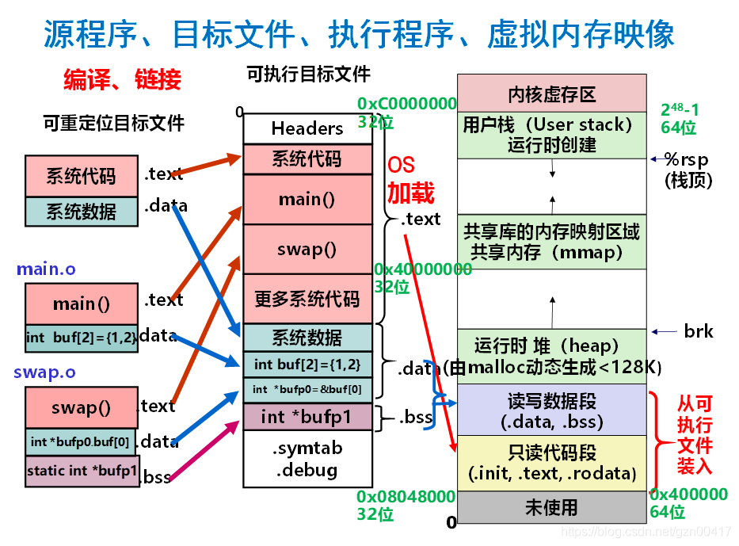

# CSAPP 第七章链接

## 1.前言

### 	1.1 链接的定义

​		链接就是将各种代码和数据片段收集并组合成单一文件的过程。

​		链接技术使得**分离编译**成为可能。我们不需要将一个大型文件组织成一个巨大的源文件，而是可以将其分解为更小的模块。当我们对程序某个部分进行修改的时候，只需要重新编译其所在的模块，再将其链接即可。


## 2.编译器驱动程序


```bash
gcc -Og -o prog main.c sum.c
./prog #shell调用加载器loader，将prog复制到内存，并将控制流转移到程序开头
```

​		编译过程：源文件->预处理器(cpp/生成.i文件)->编译器(ccl/生成.s文件)->汇编器(as/生成.o文件)->链接器(ld/生成.exe文件)


## 3.目标文件

### 	3.1 可重定位目标文件（.o文件）

​			包含与其他可重定位目标文件相结合的代码和数据，以形成可执行的目标文件。每一个.c文件生成一个.o文件。

### 	3.2 可执行目标文件（.out文件）

​			包含可以直接复制到内存并执行的代码和数据.

### 	3.3 共享目标文件（.so文件）

​			特殊类型的可重定位目标文件，在其他的加载时或运行时，它可以**被动态加载到内存，并被动态链接**。

​			windows中被称为dll文件			


## 4.静态链接的任务

### 	4.1 符号解析

​			符号：函数、全局变量、静态变量（局部非静态变量不算）

​			将符号引用和符号定义进行关联。

### 	4.2 重定位

​			将.o文件中符号的相对内存位置（0开始）变成内存中的绝对位置。


## 5.可重定位目标文件

### 	5.1 定义

​	ELF全称为"Executable and Linkable Format",用于可执行文件、目标文件、共享库和核心转储的标准文件格式。

​	

### 5.2 组成（部分）

- Elf 头
  - 字大小、字节顺序、文件类型(.o，exec，.so)，机器类型，等等
- 段头表/程序头表
  - 页面大小，虚拟地址内存段(节)，段大小
- .text 节（代码）
  - 已编译程序的机器代码
- .rodata 节（只读数据）
  - 只读数据 : 跳转表, printf语句中的格式串等
- .data 节 （数据/可读写）
  - 已初始化全局变量和静态变量。**（局部变量保存在栈中，不出现在.data中也不出现在.bss中）**
- .bss 节 （未初始化全局变量）
  - 未初始化的全局变量和静态变量（static），运行时自动赋值为0
  - 有节头，在目标文件中不占用空间
- .symtab 节（符号表）
  - 函数和全局变量信息（不包含局部变量）
- .rel.text 节（可重定位代码）
  - .text 节的可重定位信息
  - 在可执行文件中需要修改的指令地址
  - 需修改的指令.
- .rel.data 节（可重定位数据）
  - .data 节的可重定位信息
  - 在合并后的可执行文件中需要修改的指针数据的地址
- .debug 节（调试）
  - 为符号调试的信息 (gcc -g)

### 5.3 ELF文件查看工具

- objdump
- readelf


## 6. 符号表

​	**每一个模块都会各自生成一张符号表。**

### 	6.0 C中的static关键字

​		static关键字用于将变量和函数声明**隐藏于模块内部**。任何带有static属性声明的全局变量或者函数都是模块私有的（其它的模块无法访问），任何不带static属性声明的全局变量或者函数其它模块可以访问或调用。

​		尽可能使用static来保护变量和函数是一个好习惯。

### 	6.1 全局符号

​		由模块定义的，可以被其它模块引用的符号（比如非static函数、非静态全局变量）

### 	6.2 外部符号

​		由当前模块引用其它模块的符号（可能是全局函数，也可能是非静态全局变量）

### 	6.3 局部符号

​		定义的静态全局变量、静态函数，在模块内部都可见，但模块外不可见


## 7. 符号解析

​	这里主要探讨的问题是在重名的情况下，链接器选择符号的规则。

### 	7.1 强符号和弱符号

​		强符号：已初始化的全局变量、非静态函数

​		弱符号：未初始化的全局变量

### 	7.2 解析规则

​		1.有多个同名的强符号则报错

```c
/* foo1.c */
int main(){
	return 0;
}
/* foo2.c */
int main(){
	printf("Hello!\n");
	return 0;
}
```

```c
/* foo1.c */
int x=1;
int main(){
	return 0;
}
/* foo2.c */
int x=2;
int main(){
	printf("Hello!\n");
	return 0;
}
```

​	2.有一个强符号和多个弱符号，选择强符号

```c
/* foo1.c */
int x=15213;
int main(){
    f();
    printf("x=%d\n",x);
	return 0;
}
/* foo2.c */
int x;
void f(){
    x=15212;
}
```

​	3.如果都是弱符号，随便选一个

### 	7.3 注意事项

​	多模块编程时，尽量使用static变量，避免使用全局变量

​	当引用一个外部全局符号时，请使用extern关键字（提示编译器在模块外寻找定义）

```c
/****max.c****/
#include <stdio.h>
/*外部变量声明*/
extern int g_X ;
extern int g_Y ;
int max()
{
    return (g_X > g_Y ? g_X : g_Y);
}


/***main.c****/
#include <stdio.h>
/*定义两个全局变量*/
int g_X=10;
int g_Y=20;
int max();
int main(void)
{
    int result;
    result = max();
    printf("the max value is %d\n",result);
    return 0;
}
```


## 8. 静态库

​	静态库（.a文件）通俗地说就是把若干个.o文件打包，在链接的时候会方便很多。

​	打包可以使用linux下的ar工具。

​	比如说libc.a中包含了我们常用函数（printf、scanf、atoi等等）的目标文件，libc.a在每一个C程序编译时都会被调用。libm.a包含了常见的数学函数（sqrt、sin、cos等等）。

### 	8.1 静态库的引用顺序

​	**规则：引用必须在定义之前。**

​	比如说foo.c引用了libx.a和libz.a中的函数，而这两个库又调用了liby.a中的函数，则libx.a和libz.a必须在liby.a之前！

```bash
gcc foo.c libx.a libz.a liby.a
```

​	如果是这样就会出错：

```bash
gcc -static ./libvector.a main2.c #main2.c引用了libvector.a中的函数
```

​	如果出现循环引用，比如foo.c调用libx.a中的函数，而libx.a调用liby.a中的函数，而liby.a又调用了libx.a中的函数，则libx.a必须在链接时重复出现：

```bash
gcc foo.c libx.a liby.a libx.a
```


## 9. 重定位



### 9.1 重定位条目

​	重定位条目本质是一种数据结构，如下图所示：


| 成员   | 含义                      |
| ------ | ------------------------- |
| offset | 需要被修改的引用的节偏移  |
| type   | 绝对地址引用/相对地址引用 |
| symbol | 被修改引用指向的符号      |
| addend | 有符号常数，表示偏移      |


### 9.2 相对地址引用


### 9.3 绝对地址引用


## 10. 动态链接共享库

### 10.1 动态链接的原理

​	动态链接解决了静态链接内存资源浪费的缺陷（比如说printf和scanf函数，在静态链接下，这些函数的代码将会被复制到每个运行进程的文本段中，如果一台计算机上运行上百个进程，无疑是一种对内存的浪费。）

​	共享库是一个目标模块（Linux下为.so文件，Windows下为.dll文件），它在内存和磁盘中只有一个备份，在运行或加载时，可以加载到任意的内存地址，并和一个在内存中的程序链接起来，这个过程被称为动态链接。


### 10.2 库打桩机制

​	是Linux链接器支持的一个很强大的技术。它允许你对共享库的代码进行截取，执行自己的代码（“偷梁换柱“）。比如说由于调试需要，你希望原先代码中的malloc函数更换为你自己写好的malloc函数，那这个时候就可以使用库的打桩机制。

​	打桩有三种机制，分别是编译时打桩、链接时打桩、运行时打桩。

#### 	10.2.1 编译时打桩

​	这个最容易理解，相当于在源代码上进行替换，比如用宏定义把malloc替换成mymalloc（自己的实现）。

#### 	10.2.2 链接时打桩

​	这里用到了链接器--wrap选项，--wrap f表示告诉链接器，把对f的符号引用解析成\_\_wrap_f（前缀是两个下划线），还要把对符号\_\_real\_f的引用解析为f。

```c
/* main.c */
#include <stdio.h>
#include <malloc.h>
int main(){
	int *p=malloc(64);
	free(p);
	return 0;
}
```

```c
/* malloc.h */
#ifdef MYMOCK //只有MYMOCK编译选项是，这段代码才会编译进去
    #include<stdio.h>
    #include<stdlib.h>
    void *__real_malloc(size_t size);//注意声明
    /*打桩函数*/
    void *__wrap_malloc(size_t size) 
    {
        void *ptr = __real_malloc(size);//最后会被解析成malloc
        printf("ptr is %p\n",ptr);
        return ptr;
    }
#endif
```

```bash
$ gcc -DMYMOCK mymalloc.c
$ gcc -c main.c
$ gcc -Wl,--wrap,malloc -o main main.o mymalloc.o
$ ./main
ptr is 0x95f010
```

​	我们特别关注mymalloc.c中的代码，利用链接器的打桩机制，最后在main函数中调用malloc，将会去调用__wrap_malloc，而__real_malloc将会被解析成真正的malloc，从而达到“偷梁换柱”的效果。


#### 10.2.3 运行时打桩

​	前面两种打桩方式，一种需要访问源代码，另外一种至少要访问可重定位文件。

​	运行时打桩没有这么多要求。运行时打桩可以通过设置`LD_PRELOAD`环境变量，达到在你加载一个动态库或者解析一个符号时，先从`LD_PRELOAD`指定的目录下的库去寻找需要的符号，然后再去其他库中寻找。

​	修改`mymalloc.c`

```c
#ifdef RUNTIME
#define _GNU_SOURCE
#include <stdio.h>
#include <stdlib.h>
#include <dlfcn.h>

void *malloc(size_t size)
{
    void *(*mallocp)(size_t size);
    char *error;

    mallocp = dlsym(RTLD_NEXT, "malloc");
    if ((error = dlerror()) != NULL)
    {
        fputs(error, stderr);
        exit(1);
    }
    char *ptr = mallocp(size);
    printf("malloc(%d) = %p\n", (int)size, ptr);
    return ptr;
}

void free(void *ptr)
{
    void (*freep)(void *) = NULL;
    char *error;

    if (!ptr)
        return;

    freep = dlsym(RTLD_NEXT, "free");
    if ((error = dlerror()) != NULL)
    {
        fputs(error, stderr);
        exit(1);
    }
    freep(ptr);
    printf("free(%p)\n", ptr);
}
#endif
```

编译指令

```bash
gcc –DRUNTIME –shared –fpic –o mymalloc.so mymalloc.c –ldl
```

```c
/* main.c */
#include <stdio.h>
#include <malloc.h>

int main(int argc, char **argv[])
{
    int *p = malloc(32);
    free(p);
    return 0;
}
```

编译指令

```bash
gcc –o intr int.c
LD_PRELOAD=”./mymalloc.so”
./intr
```

**然而会报错（Core dump segmentation fault）**

这是因为我们的malloc函数中调用了printf函数，printf函数又调用了我们的malloc函数，malloc函数又会调用printf函数……这产生了一个调用死循环，栈就溢出了。

首先要尽量避免在自己写的malloc函数中调用其他标准库函数，毕竟不清楚标准库函数的内部实现机制。但是为了输出一些信息，printf函数还是要保留的，那么怎么办呢？首先考虑单线程的情况，如果在我们自己写的malloc函数中发生了循环调用自己malloc的情况，唯一的可能就是printf调用了malloc。我们可以设置一个静态计数变量count，每次完成执行malloc函数后将count清零，每次进入malloc函数后count自增1，如果count=1，说明现在调用栈上只有对自定义malloc函数的一次调用，这时可以调用printf输出信息；如果count=2，说明此时调用栈上对malloc函数发生了第二次调用，即一个malloc函数还没有执行完，就又进行了一次malloc函数调用，我们认为这个问题出在printf上，此时我们就不再调用printf了。

```c
void *malloc(size_t size)
{
    static __thread int print_times = 0;
    print_times++;
    void *(*mallocp)(size_t size);
    char *error;

    mallocp = dlsym(RTLD_NEXT, "malloc");
    if ((error = dlerror()) != NULL)
    {
        fputs(error, stderr);
        exit(1);
    }
    char *ptr = mallocp(size);
    if (print_times == 1)
    {
        printf("malloc(%d) = %p\n", (int)size, ptr);
    }
    print_times = 0;
    return ptr;
}
```

最后程序可以正常执行。

