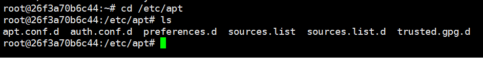
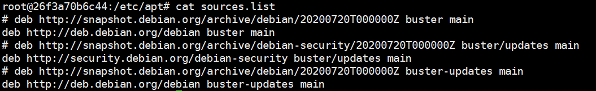
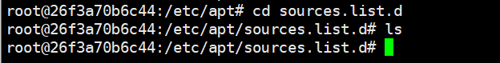
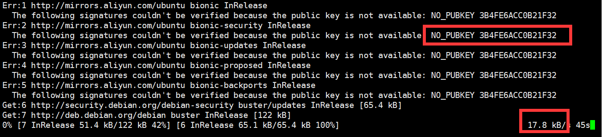
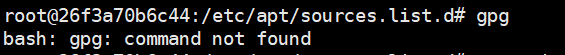

# docker容器apt换源

## 1. 问题描述

​	一般来说，从官网上下的镜像在运行后，很多软件都是没有的，比如说`vim`、`git`等。

​	要安装新的软件则需要使用`apt-get`命令，但是容器自带的`apt-get`版本都需要`update`才能正常安装，系统自带的国外源非常慢，因此需要将容器内的源设置成国内的源。


## 2. 环境介绍

​	首先先`cd`到`/etc/apt`目录：

```bash
cd /etc/apt
```



​	目录下有若干个文件，其中需要我们注意的是`sources.list`以及`sources.list.d`。

​	`source.list`存放着系统默认的buster源，如下图所示：



​	我们先对`source.list`做一个备份（这一步不是必须的）：

```bash
cp /etc/apt/source.list /etc/apt/source.list.bak
```

​	经过我的试验，这个文件其实是可以为空的，它是一个默认源。

​	`	source.list.d`是一个文件夹。

​	在`source.list`中找不到可用源时，系统会在`source.list.d`中搜寻`.list`文件作为备选源。



​	在我的环境中，`source.list.d`中空空如也。


## 3. 创建新源

​	我们采用阿里云的镜像源，并将文本通过`cat`重定向的方式写入`.list`文件

```bash
echo '
deb http://mirrors.aliyun.com/ubuntu/ bionic main restricted universe multiverse
deb-src http://mirrors.aliyun.com/ubuntu/ bionic main restricted universe multiverse

deb http://mirrors.aliyun.com/ubuntu/ bionic-security main restricted universe multiverse
deb-src http://mirrors.aliyun.com/ubuntu/ bionic-security main restricted universe multiverse

deb http://mirrors.aliyun.com/ubuntu/ bionic-updates main restricted universe multiverse
deb-src http://mirrors.aliyun.com/ubuntu/ bionic-updates main restricted universe multiverse

deb http://mirrors.aliyun.com/ubuntu/ bionic-proposed main restricted universe multiverse
deb-src http://mirrors.aliyun.com/ubuntu/ bionic-proposed main restricted universe multiverse

deb http://mirrors.aliyun.com/ubuntu/ bionic-backports main restricted universe multiverse
deb-src http://mirrors.aliyun.com/ubuntu/ bionic-backports main restricted universe multiverse 
' > /etc/apt/sources.list.d/aliyun.list
```

​	之后可以运行更新命令：

```bash
apt-get update
```

​	但是这样还没有结束，更新依然很慢，因为我们/etc/apt/sources.list中仍然是国外源。

​	你可以选择删除这个文件或者是将它原本的内容清除。

```bash
rm -f /etc/apt/sources.list #或者 cat > /etc/apt/sources.list
```

​	同时你还会遇到一些很奇怪的错误（GPG），如下图所示：




## 4. 错误解决

​	这个错误是由于缺失公钥，因此我们要向`ubuntu-keyserver`申请，先后运行如下命令：

```bash
gpg --keyserver keyserver.ubuntu.com --recv 3B4FE6ACC0B21F32 #这里的3B4FE6ACC0B21F32 替换成你自己的
gpg --export --armor 3B4FE6ACC0B21F32 | apt-key add -
```

​	在这之后，运行`apt-get update`即可。

### 	*4.1如果你没有gpg



​		如果你的容器连gpg也没有安装的话，那就只能依靠挂载来实现gpg的安装。

## 5. 注意

​	**我这里所有的命令都没有`sudo`，如果出现权限错误，请在以上所有命令前加上`sudo`重试。**