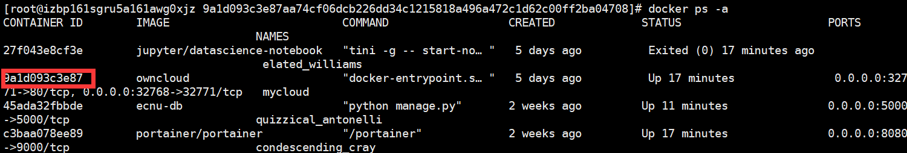
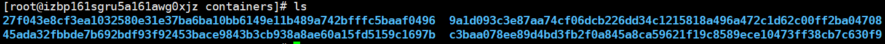
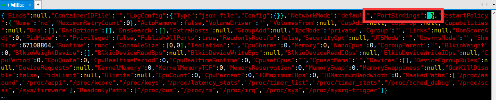
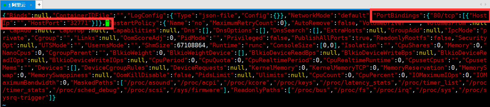
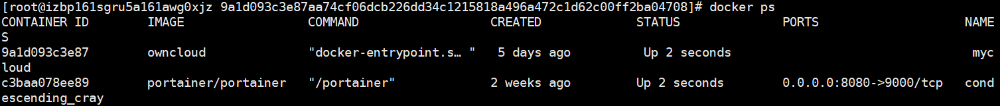
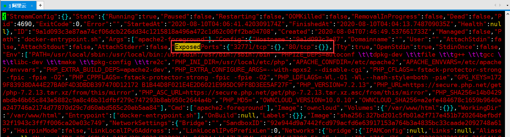
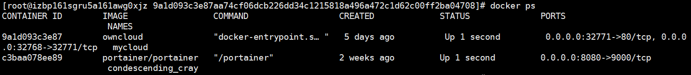

# 1. 问题描述

​	在docker run创建并运行容器的时候，可以通过`-p`指定端口映射规则。但是，我们经常会遇到刚开始忘记设置端口映射或者设置错了需要修改。docker start命令没有提供一个`-p`选项或设置，让你修改指定端口映射规则，因此我们需要手动进行修改。


# 2. 方法一：删除原有容器，重新建新容器

​	这个解决方案最为简单，把原来的容器删掉，重新建一个，并用`-p`设置端口映射。


# 3. 方法二：修改容器配置文件，重启docker服务

​	容器的配置文件路径：

> /var/lib/docker/containers/[hash_of_the_container]/hostconfig.json

​	其中`hash_of_the_container`是容器的hash值，通过`docker ps -a`可以获得



​	`cd`到`/var/lib/docker/containers/`



​	找到容器对应hash值的文件夹进入：


​	**请注意！在修改配置文件前，请务必把容器服务停止，否则对配置文件的修改将会被还原！**

```bash
service docker stop
```

​	接下来修改`hostconfig.json`中的内容，其中有一项`PortBindings`：



​	我们添加`"80/tcp":[{"HostIp":"","HostPort":"32771"}]`，表示将容器内的`80`端口映射到宿主机的`32771`端口。



​	修改保存后，重启docker服务：

```bash
service docker start
docker start 9a1 #这里的9a1是我的容器hash
```

​	但是发现不行，PORTS这一栏为空，如下图所示：



​	这是因为我们没有将端口暴露出去，所以我们还需要修改`config.v2.json`这个文件。

​	先停止docker服务，然后用vim打开`config.v2.json`，修改`"ExposedPorts"`字段（如果没有就自行添加），如下图所示。



```bash
service start docker
docker ps
```

​	端口映射设置成功！

