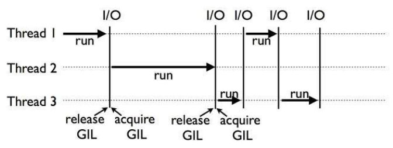

# 深入理解Python中的GIL（全局解释器锁）

## 前言

*"For more than a decade, no single issue has caused more frustration or curiosity for Python novices and experts alike than the Global Interpreter Lock."*

## Q1：GIL导致了什么问题？

​		在大多数环境中，单核CPU情况下，本质上某一时刻只能有一个线程被执行，多核CPU时则 可以支持多个线程同时执行。**但是在Python中，无论CPU有多少核，同时只能执行一个线程。**这是由于GIL的存在导致的。

​		如下图所示：

​		

## Q2：什么是GIL？

​		GIL的全称是`Global Interpreter Lock`(全局解释器锁)，是Python设计之初为了数据安全所做的决定。

​		Python中的某个线程想要执行，必须先拿到`GIL`。你可以把`GIL`看作是执行任务的“通行证”，并且在一个Python进程中，`GIL`只有一个。拿不到通行证的线程，就不允许进入CPU执行。

​		**GIL只在CPython解释器中才有**，因为CPython调用的是c语言的原生线程，不能直接操作cpu，只能利用GIL保证同一时间只能有一个线程拿到数据。

​		因此，严格来说，`GIL`并不是Python这个语言的特性（在PyPy和JPython中就没有`GIL`），由于CPython的使用基数过大，因而使得人们产生了`GIL`是Python特性的错觉。