# 红黑树（rbtree）笔记

## 强烈推荐：数据结构可视化网站

​	https://www.cs.usfca.edu/~galles/visualization/RedBlack.html

​	上述网站将rbtree的数据结构以动画的方式呈现了出来，便于我们去理解整个数据结构的执行流程。

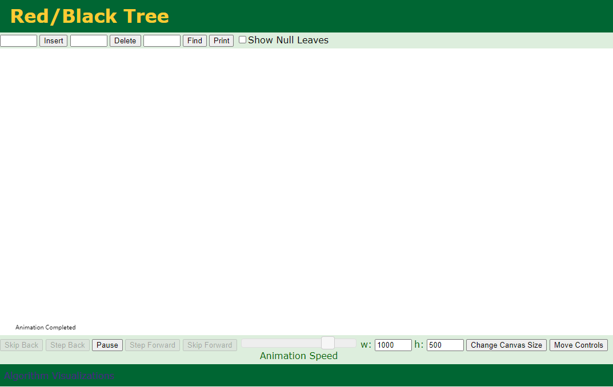

## 定义

​	红黑树是一棵二叉查找树（但不是平衡树），同时它满足以下性质：

1. 每个结点有红/黑两种颜色
2. 根节点是黑色
3. 红色结点不相邻（但黑色结点可以相邻）
4. 叶子结点都是黑色的，且为`NULL`
5. 从任一节点到其每个叶子的所有[简单路径](https://zh.wikipedia.org/wiki/道路_(图论))都包含相同数目的黑色节点。


## 为什么rbtree可以保持查找效率？

​	以上5条性质保证了树的一个关键特性：**从根到叶子的最长的可能路径不多于最短的可能路径的两倍长。结果是这个树大致上是平衡的。**要知道为什么这些性质确保了这个结果，注意到性质3导致了路径不能有两个毗连的红色节点就足够了。最短的可能路径都是黑色节点，最长的可能路径有交替的红色和黑色节点。因为根据性质5所有最长的路径都有相同数目的黑色节点，这就表明了没有路径能多于任何其他路径的两倍长。

​	虽然AVL Tree可以更好地保证树的平衡性，但是由于“平衡“的条件过于苛刻，所以对树的插入/删除操作都有可能会导致大量的旋转，这也就直接降低了效率。红黑树放宽了“平衡”的条件，从而旋转操作减少了。

​	一句话：**红黑树相对于AVL树来说，牺牲了部分平衡性以换取插入/删除操作时少量的旋转操作，整体来说性能要优于AVL树。**


## 变换规则

1. 将节点变色（红变黑、黑变红）

2. 左旋

3. 右旋

   

## 查找

​	红黑树本质上是一棵二叉查找树，因而在其上面查找与在普通的二叉查找树上查找并没有什么区别。


## 插入

### 总体思路

​	第一步：找到插入的位置（类似查找操作），并插入结点（新结点为红色）

​	第二步：调整树的结构，使之满足红黑树的性质

​	但是插入的情况是非常复杂的，一共有8种：


### 情况一：空树

​	将插入结点标记为黑色并作为根节点即可。


### 情况二：插入结点的key存在

​	插入结点的Key已存在，既然红黑树总保持平衡，在插入前红黑树已经是平衡的，那么把插入结点设置为将要替代结点的颜色，再把结点的值更新就完成插入。


### 情况三：插入结点的父结点为黑色

​	由于插入的结点是红色的，当插入结点的黑色时，并不会影响红黑树的平衡，直接插入即可，无需做自平衡。


### 情况四：插入结点的父结点为红结点

​	根结点是黑色。**如果插入的父结点为红结点，那么该父结点不可能为根结点，所以插入结点总是存在祖父结点**。这点很重要，因为后续的旋转操作肯定需要祖父结点的参与。

#### 	情况4.1：叔叔结点存在并且为红结点	

​	其中，I是我们要插入的结点，P是I的父亲，S是I的叔叔结点，PP是I的祖父。

​	对于这种情况，我们只需要将P、S改成黑色，PP改成红色即可，如下图所示：

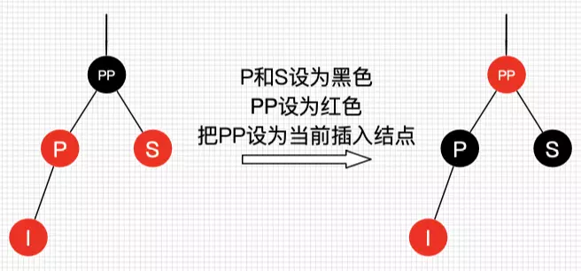

​	虽然下图和上图看上去不一样，实际上仍然是同一种情况：

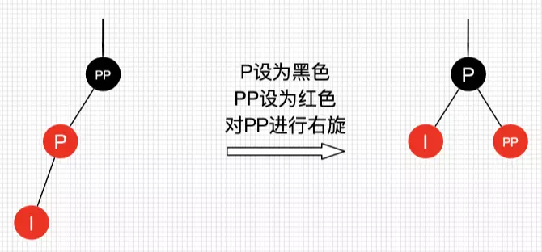

​	可以看到，我们把PP结点设为红色了，如果PP的父结点是黑色，那么无需再做任何处理；但如果PP的父结点是红色，此时红黑树已不平衡了，**所以还需要把PP当作新的插入结点**，继续做插入操作自平衡处理，直到平衡为止。

#### 	情况4.2 叔叔结点不存在或为黑结点，并且插入结点的父亲结点是祖父结点的左子结点

##### 		情况4.2.1 插入结点是其父结点的左子结点

​	

​	

##### 		情况4.2.2 插入结点是其父结点的右子结点

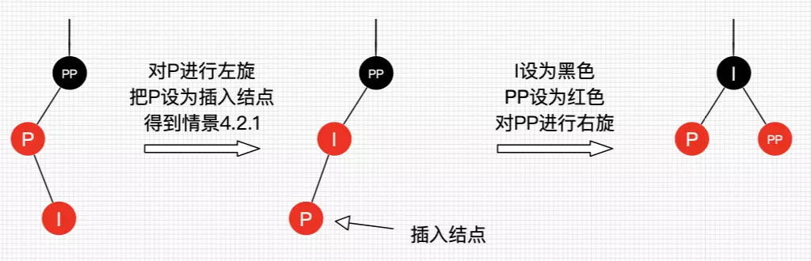


#### 	情况4.3 叔叔结点不存在或为黑结点，并且插入结点的父亲结点是祖父结点的右子结点	

是情况4.2的镜像情况

##### 		情况4.3.1 插入结点是其父结点的右子结点

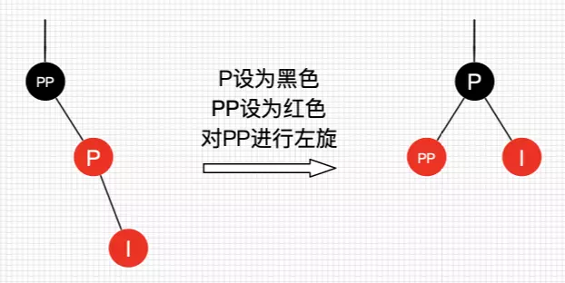

##### 			情况4.3.2：插入结点是其父结点的左子结点

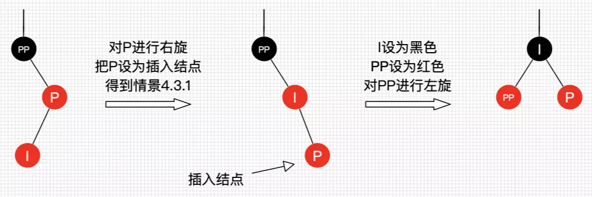


## 删除

### 总体思路

​	第一步：查找要删除的目标结点

​	第二步：找到目标结点的替代结点，将替代结点覆盖目标结点，将问题转化为删除替代结点的问题

​	第三步：删除结点，调整树结构满足红黑树性质

​	

### 替代结点的选择

- 情景1：若删除结点无子结点，直接删除

- 情景2：若删除结点只有一个子结点，用子结点替换删除结点

- 情景3：若删除结点有两个子结点，用**后继结点**（大于删除结点的最小结点）替换删除结点

  **针对情景3，可以先进入目标结点的右子树，然后不停找最左下的结点即可。**

  **如果需要删除的节点有两个儿子，那么问题可以被转化成删除另一个只有一个儿子的节点的问题**。

  对于二叉查找树，在删除带有两个非叶子儿子的节点的时候，我们要么找到它左子树中的最大元素（前驱结点）、要么找到它右子树中的最小元素（后继结点），并把它的值转移到要删除的节点中。我们接着删除我们从中复制出值的那个节点，它必定有少于两个非叶子的儿子。因为只是复制了一个值（没有复制颜色），不违反任何性质，这就把问题简化为如何删除最多有一个儿子的节点的问题。

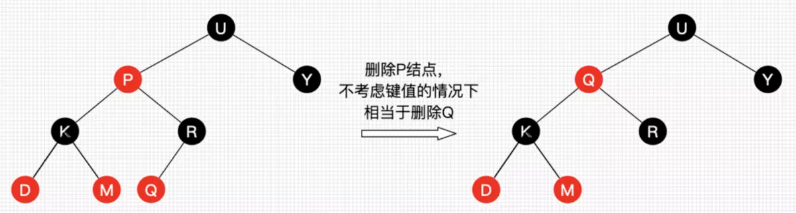


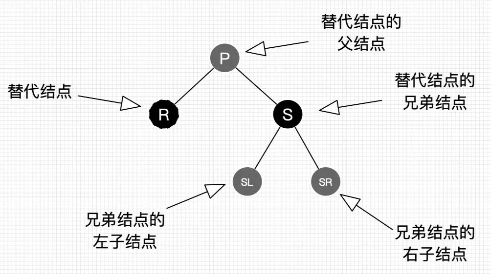

### 情况一：替换结点是红色结点

​	我们把替换结点换到了删除结点的位置时，由于替换结点时红色，删除也了不会影响红黑树的平衡，只要把替换结点的颜色设为删除的结点的颜色即可重新平衡。


### 情况二：替换结点是黑结点

​	当替换结点是黑色时，我们就不得不进行自平衡处理了。我们必须还得考虑替换结点是其父结点的左子结点还是右子结点，来做不同的旋转操作，使树重新平衡。

#### 	情况2.1：替换结点是其父结点的左子结点

##### 		情况2.1.1：替换结点的兄弟结点是红结点

​		若兄弟结点是红结点，那么根据性质4，兄弟结点的父结点和子结点肯定为黑色，不会有其他子情景，我们按图21处理，得到删除情景2.1.2.3（后续讲解，这里先记住，此时R仍然是替代结点，它的新的兄弟结点SL和兄弟结点的子结点都是黑色）。

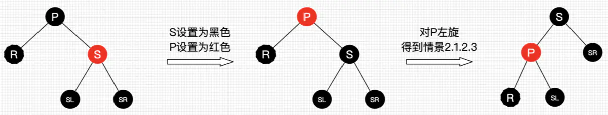

##### 		情况2.1.2：替换结点的兄弟结点是黑结点

​		当兄弟结点为黑时，其父结点和子结点的具体颜色也无法确定（如果也不考虑自底向上的情况，子结点非红即为叶子结点Nil，Nil结点为黑结点），此时又得考虑多种子情景。

###### 		情况2.1.2.1：替换结点的兄弟结点的右子结点是红结点，左子结点任意颜色		

​		即将删除的左子树的一个黑色结点，显然左子树的黑色结点少1了，然而右子树又又红色结点，那么我们直接向右子树“借”个红结点来补充黑结点就好啦，此时肯定需要用旋转处理了。如图22所示。

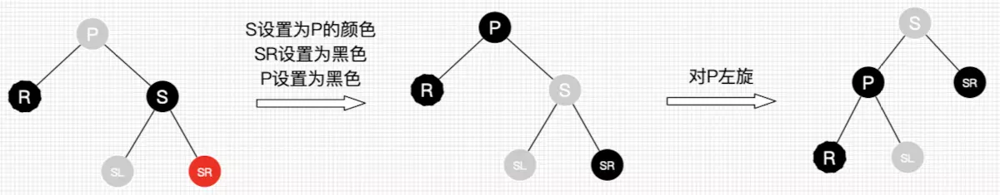		平衡后的图怎么不满足红黑树的性质？前文提醒过，R是即将替换的，它还参与树的自平衡，平衡后再替换到删除结点的位置，所以R最终可以看作是删除的。另外图2.1.2.1是考虑到第一次替换和自底向上处理的情况，如果只考虑第一次替换的情况，根据红黑树性质，SL肯定是红色或为Nil，所以最终结果树是平衡的。如果是自底向上处理的情况，同样，每棵子树都保持平衡状态，最终整棵树肯定是平衡的。后续的情景同理，不做过多说明了。

###### 		情况2.1.2.2：替换结点的兄弟结点的右子结点为黑结点，左子结点为红结点

​		兄弟结点所在的子树有红结点，我们总是可以向兄弟子树借个红结点过来，显然该情景可以转换为情景2.1.2.1。图如23所示。

###### 		情况2.1.2.3：替换结点的兄弟结点的子结点都为黑结点

​		好了，此次兄弟子树都没红结点“借”了，兄弟帮忙不了，找父母呗，这种情景我们把兄弟结点设为红色，再把父结点当作替代结点，自底向上处理，去找父结点的兄弟结点去“借”。但为什么需要把兄弟结点设为红色呢？显然是为了在P所在的子树中保证平衡（R即将删除，少了一个黑色结点，子树也需要少一个），后续的平衡工作交给父辈们考虑了，还是那句，当每棵子树都保持平衡时，最终整棵总是平衡的。

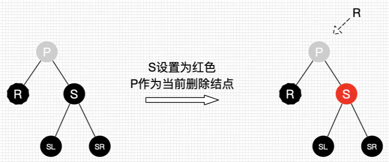

#### 	情况2.2：替换结点是其父结点的右子结点

​	是情况2.1的镜像版，在此不再阐述。


# 代码实现（wiki）

```cpp
#define BLACK 1
#define RED 0
#include <iostream>

using namespace std;

class bst {
private:

    struct Node {
        int value;
        bool color;
        Node *leftTree, *rightTree, *parent;

        Node() : value(0), color(RED), leftTree(NULL), rightTree(NULL), parent(NULL) { }        

        Node* grandparent() {
            if(parent == NULL){
                return NULL;
            }
            return parent->parent;
        }

        Node* uncle() {
            if(grandparent() == NULL) {
                return NULL;
            }
            if(parent == grandparent()->rightTree)
                return grandparent()->leftTree;
            else
                return grandparent()->rightTree;
        }

        Node* sibling() {
            if(parent->leftTree == this)
                return parent->rightTree;
            else
                return parent->leftTree;
        }
    };

    void rotate_right(Node *p){
        Node *gp = p->grandparent();
        Node *fa = p->parent;
        Node *y = p->rightTree;

        fa->leftTree = y;

        if(y != NIL)
            y->parent = fa;
        p->rightTree = fa;
        fa->parent = p;

        if(root == fa)
            root = p;
        p->parent = gp;

        if(gp != NULL){
            if(gp->leftTree == fa)
                gp->leftTree = p;
            else
                gp->rightTree = p;
        }

    }

    void rotate_left(Node *p){
        if(p->parent == NULL){
            root = p;
            return;
        }
        Node *gp = p->grandparent();
        Node *fa = p->parent;
        Node *y = p->leftTree;

        fa->rightTree = y;

        if(y != NIL)
            y->parent = fa;
        p->leftTree = fa;
        fa->parent = p;

        if(root == fa)
            root = p;
        p->parent = gp;

        if(gp != NULL){
            if(gp->leftTree == fa)
                gp->leftTree = p;
            else
                gp->rightTree = p;
        }
    }

    void inorder(Node *p){
        if(p == NIL)
            return;

        if(p->leftTree)
            inorder(p->leftTree);

        cout << p->value << " ";
                
        if(p->rightTree)
            inorder(p->rightTree);
    }

    string outputColor (bool color) {
        return color ? "BLACK" : "RED";
    }

    Node* getSmallestChild(Node *p){
        if(p->leftTree == NIL)
            return p;
        return getSmallestChild(p->leftTree);
    }

    bool delete_child(Node *p, int data){
        if(p->value > data){
            if(p->leftTree == NIL){
                return false;
            }
            return delete_child(p->leftTree, data);
        } else if(p->value < data){
            if(p->rightTree == NIL){
                return false;
            }
            return delete_child(p->rightTree, data);
        } else if(p->value == data){
            if(p->rightTree == NIL){
                delete_one_child (p);
                return true;
            }
            Node *smallest = getSmallestChild(p->rightTree);
            swap(p->value, smallest->value);
            delete_one_child (smallest);

            return true;
        }else{
           return false;
         }
    }

    void delete_one_child(Node *p){
        Node *child = p->leftTree == NIL ? p->rightTree : p->leftTree;
        if(p->parent == NULL && p->leftTree == NIL && p->rightTree == NIL){
            p = NULL;
            root = p;
            return;
        }
        
        if(p->parent == NULL){
            delete  p;
            child->parent = NULL;
            root = child;
            root->color = BLACK;
            return;
        }
        
        if(p->parent->leftTree == p){
            p->parent->leftTree = child;
        } else {
            p->parent->rightTree = child;
        }
        child->parent = p->parent;

        if(p->color == BLACK){
            if(child->color == RED){
                child->color = BLACK;
            } else
                delete_case (child);
        }

        delete p;
    }

    void delete_case(Node *p){
        if(p->parent == NULL){
            p->color = BLACK;
            return;
        }
        if(p->sibling()->color == RED) {
            p->parent->color = RED;
            p->sibling()->color = BLACK;
            if(p == p->parent->leftTree)
                //rotate_left(p->sibling());
                rotate_left(p->parent);
            else
                //rotate_right(p->sibling());
                rotate_right(p->parent);
        }
        if(p->parent->color == BLACK && p->sibling()->color == BLACK
                && p->sibling()->leftTree->color == BLACK && p->sibling()->rightTree->color == BLACK) {
            p->sibling()->color = RED;
            delete_case(p->parent);
        } else if(p->parent->color == RED && p->sibling()->color == BLACK
                && p->sibling()->leftTree->color == BLACK && p->sibling()->rightTree->color == BLACK) {
            p->sibling()->color = RED;
            p->parent->color = BLACK;
        } else {
            if(p->sibling()->color == BLACK) {
                if(p == p->parent->leftTree && p->sibling()->leftTree->color == RED
                        && p->sibling()->rightTree->color == BLACK) {
                    p->sibling()->color = RED;
                    p->sibling()->leftTree->color = BLACK;
                    rotate_right(p->sibling()->leftTree);
                } else if(p == p->parent->rightTree && p->sibling()->leftTree->color == BLACK
                        && p->sibling()->rightTree->color == RED) {
                    p->sibling()->color = RED;
                    p->sibling()->rightTree->color = BLACK;
                    rotate_left(p->sibling()->rightTree);
                }
            }
            p->sibling()->color = p->parent->color;
            p->parent->color = BLACK;
            if(p == p->parent->leftTree){
                p->sibling()->rightTree->color = BLACK;
                rotate_left(p->sibling());
            } else {
                p->sibling()->leftTree->color = BLACK;
                rotate_right(p->sibling());
            }
        }
    }

    void insert(Node *p, int data){
        if(p->value >= data){
            if(p->leftTree != NIL)
                insert(p->leftTree, data);
            else {
                Node *tmp = new Node();
                tmp->value = data;
                tmp->leftTree = tmp->rightTree = NIL;
                tmp->parent = p;
                p->leftTree = tmp;
                insert_case (tmp);
            }
        } else {
            if(p->rightTree != NIL)
                insert(p->rightTree, data);
            else {
                Node *tmp = new Node();
                tmp->value = data;
                tmp->leftTree = tmp->rightTree = NIL;
                tmp->parent = p;
                p->rightTree = tmp;
                insert_case (tmp);
            }
        }
    }

    void insert_case(Node *p){
        if(p->parent == NULL){
            root = p;
            p->color = BLACK;
            return;
        }
        if(p->parent->color == RED){
            if(p->uncle()->color == RED) {
                p->parent->color = p->uncle()->color = BLACK;
                p->grandparent()->color = RED;
                insert_case(p->grandparent());
            } else {
                if(p->parent->rightTree == p && p->grandparent()->leftTree == p->parent) {
                    rotate_left(p);
                    p->color = BLACK;
                    p->leftTree->color = p->rightTree->color = RED;
                } else if(p->parent->leftTree == p && p->grandparent()->rightTree == p->parent) {
                    rotate_right(p);
                    p->color = BLACK;
                    p->leftTree->color = p->rightTree->color = RED;
                } else if(p->parent->leftTree == p && p->grandparent()->leftTree == p->parent) {
                    p->parent->color = BLACK;
                    p->grandparent()->color = RED;
                    rotate_right(p->parent);
                } else if(p->parent->rightTree == p && p->grandparent()->rightTree == p->parent) {
                    p->parent->color = BLACK;
                    p->grandparent()->color = RED;
                    rotate_left(p->parent);
                }
            }
        }
    }

    void DeleteTree(Node *p){
        if(!p || p == NIL){
            return;
        }
        DeleteTree(p->leftTree);
        DeleteTree(p->rightTree);
        delete p;
    }
public:

    bst() {
        NIL = new Node();
        NIL->color = BLACK;
        root = NULL;
    }

    ~bst() {
        if (root)
            DeleteTree (root);
        delete NIL;
    }

    void inorder() {
        if(root == NULL)
            return;
        inorder (root);
        cout << endl;
    }

    void insert (int x) {
        if(root == NULL){
            root = new Node();
            root->color = BLACK;
            root->leftTree = root->rightTree = NIL;
            root->value = x;
        } else {
            insert(root, x);
        }
    }

    bool delete_value (int data) {
        return delete_child(root, data);
    }
private:
    Node *root, *NIL;
};
```


# 参考资料

1. [https://zh.wikipedia.org/wiki/%E7%BA%A2%E9%BB%91%E6%A0%91](https://zh.wikipedia.org/wiki/红黑树)
2. https://www.cs.usfca.edu/~galles/visualization/RedBlack.html
3. https://www.jianshu.com/p/e136ec79235c