# Redis

学习方式：不是为了面试和工作学习！仅仅是为了兴趣！兴趣才是最好的老师！

- 基本的理论先学习，然后将知识融汇贯通！

  

## Redis课程安排：

- nosql讲解
- 阿里巴巴架构演
- nosql数据模型
- Nosql 四大分类 
- CAP
- BASE
- Redis入门
- Redis安装（Window & Linux服务器）
- 五大基本数据类型
  - String 
  - List 
  - Set 
  - Hash 
  - Zset
- 三种特殊数据类型
  - geo 
  - hyperloglog 
  - bitmap
- Redis 配置详解
- Redis 持久化
  - RDB
  - AOF
- Redis 事务操作
- Redis 实现订阅发布
- Redis 主从复制
- Redis 哨兵模式（现在公司中所有的集群都用哨兵模式
- 缓存穿透及解决方案 缓存击穿及解决方案缓存雪崩及解决方案
- 基础API 之 Jedis 详解
- SpringBoot 集成 Redis 操作


# Nosql概述

## 为什么要用Nosql

> 1、单机MySQL的年代！

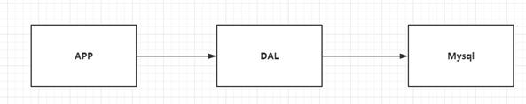

90年代，一个基本的网站访问量一般不会太大，单个数据库完全足够！

 那个时候，更多的去使用静态网页 Html ~ 服务器根本没有太大的压力！

 思考一下，这种情况下：整个网站的瓶颈是什么？

1、数据量如果太大、一个机器放不下了！

2、数据的索引 （B+ Tree），一个机器内存也放不下 

3、访问量（读写混合），一个服务器承受不了~

只要你开始出现以上的三种情况之一，那么你就必须要晋级！

> 2、Memcached（缓存） + MySQL + 垂直拆分 （读写分离）

网站80%的情况都是在读，每次都要去查询数据库的话就十分的麻烦！

所以说我们希望减轻数据的压力，我们可以使用缓存来保证效率！ 

发展过程： 优化数据结构和索引--> 文件缓存（IO）---> Memcached（当时最热门的技术！）

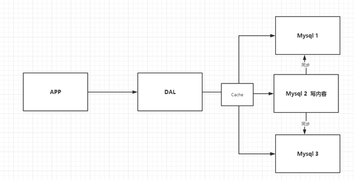

> 3、分库分表 + 水平拆分 + MySQL集群

早些年MyISAM： 表锁，十分影响效率！高并发下就会出现严重的锁问题 

转战Innodb：行锁

慢慢的就开始使用分库分表来解决写的压力！

MySQL在哪个年代推出了表分区！这个并没有多少公司 使用！

MySQL的集群，很好满足那个年代的所有需求！


> 4、如今最近的年代

2010--2020 十年之间，世界已经发生了翻天覆地的变化；（定位，也是一种数据，音乐，热榜！）

MySQL 等关系型数据库就不够用了！数据量很多，变化很快~！

MySQL 有的使用它来村粗一些比较大的文件，博客，图片！数据库表很大，效率就低了！如果有一种数据库来专门处理这种数据,

MySQL压力就变得十分小（研究如何处理这些问题！）大数据的IO压力下，表几乎没法更大

> 目前一个基本的互联网项目！

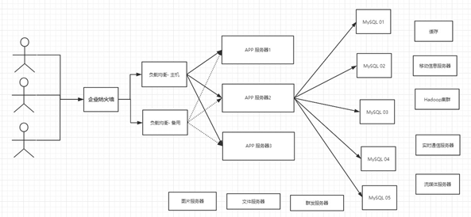

> 为什么要用NoSQL！

用户的个人信息，社交网络，地理位置。用户自己产生的数据，用户日志等等爆发式增长！

这时候我们就需要使用NoSQL数据库的，Nosql 可以很好的处理以上的情况！


## 什么是NoSQL

> NoSQL

NoSQL = Not Only SQL （不仅仅是SQL）关系型数据库：表格 ，行 ，列

泛指非关系型数据库的，随着web2.0互联网的诞生！传统的关系型数据库很难对付web2.0时代！尤其是超大规模的高并发的社区！ 暴露出来很多难以克服的问题，NoSQL在当今大数据环境下发展的十分迅速，Redis是发展快的，而且是我们当下必须要掌握的一个技术！

很多的数据类型用户的个人信息，社交网络，地理位置。这些数据类型的存储不需要一个固定的格式！不需要多余的操作就可以横向扩展的 ！  Map<String,Object> 使用键值对来控制！

> NoSQL 特点

解耦！

1、  方便扩展（数据之间没有关系，很好扩展！）

2、  大数据量高性能（Redis 一秒写8万次，读取11万，NoSQL的缓存记录级，是一种细粒度的缓存，性能会比较高！）

3、  数据类型是多样型的！（不需要事先设计数据库！随取随用！如果是数据量十分大的表，很多人就无法设计了！）

4、  传统 RDBMS 和 NoSQL

```txt
传统的 RDBMS
- 结构化组织
- SQL
- 数据和关系都存在单独的表中 row col
- 操作操作，数据定义语言
- 严格的一致性
- 基础的事务
- .....
```

```txt
Nosql
- 不仅仅是数据
- 没有固定的查询语言
- 键值对存储，列存储，文档存储，图形数据库（社交关系）
- 最终一致性，
- CAP定理和BASE （异地多活） 初级架构师！
- 高性能，高可用，高可扩
- ....
```


> 了解：3V+3高

大数据时代的3V：主要是描述问题的

1. 海量Volume
2. 多样Variety
3. 实时Velocity

大数据时代的3高：主要是对程序的要求

1. 高并发
2. 高可扩
3. 高性能

真正在公司中的实践：NoSQL + RDBMS 一起使用才是最强的，阿里巴巴的架构演进！ 

技术没有高低之分，就看你如何去使用！（提升内功，思维的提高！）


## 阿里巴巴演进分析

思考问题：这么多东西难道都是在一个数据库中的吗?


技术急不得，越是慢慢学，才能越扎实！
开源才是技术的王道！
任何一家互联网的公司，都不可能只是简简单单让用户能用就好了！
大量公司做的都是相同的业务；（竞品协议）
随着这样的竞争，业务是越来越完善，然后对于开发者的要求也是越来越高！

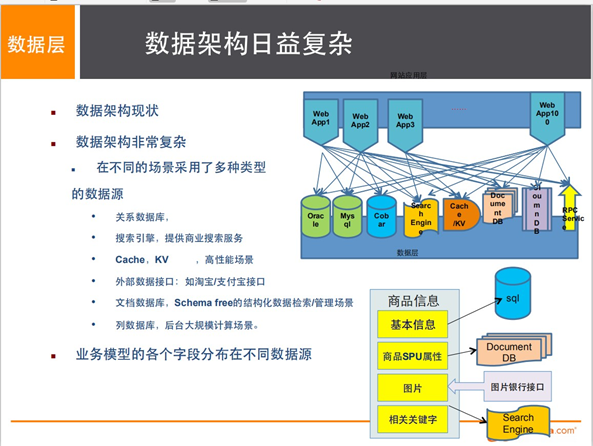


如果你未来相当一个架构师： 没有什么是加一层解决不了的！

```bash
# 1、商品的基本信息
    名称、价格、商家信息；
    关系型数据库就可以解决了！ MySQL / Oracle （淘宝早年就去IOE了！- 王坚：推荐文章：阿里云
    的这群疯子：40分钟重要！）
    淘宝内部的 MySQL 不是大家用的 MySQL

# 2、商品的描述、评论（文字比较多）
	文档型数据库中，MongoDB
	
# 3、图片
    分布式文件系统 FastDFS
    - 淘宝自己的 TFS
    - Gooale的 GFS
    - Hadoop HDFS
    - 阿里云的 oss
    
# 4、商品的关键字 （搜索）
    - 搜索引擎 solr elasticsearch
    - ISerach：多隆（多去了解一下这些技术大佬！）
    所有牛逼的人都有一段苦逼的岁月！但是你只要像SB一样的去坚持，终将牛逼！
    
# 5、商品热门的波段信息
    - 内存数据库
    - Redis Tair、Memache...
    
# 6、商品的交易，外部的支付接口
	- 三方应用
```

要知道，一个简单地网页背后的技术一定不是大家所想的那么简单！

大型互联网应用问题：

+ 数据类型太多了！
+ 数据源繁多，经常重构！
+ 数据要改造，大面积改造？

解决问题：

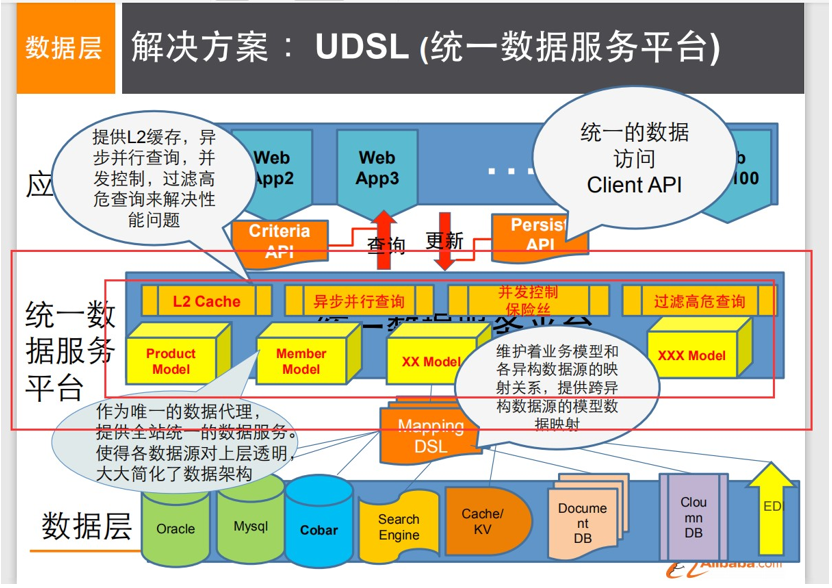

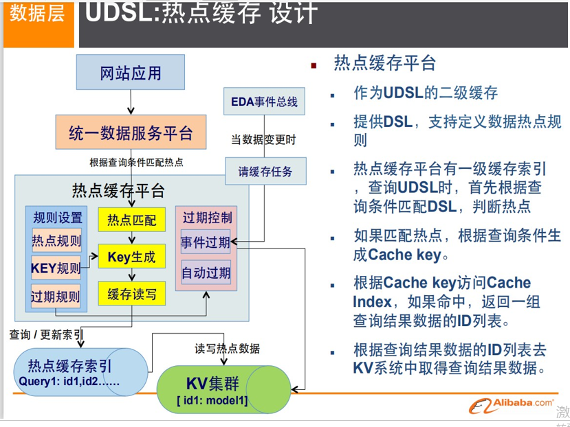

这里以上都是NoSQL入门概述，不仅能够提高大家的知识，还可以帮助大家了解大厂的工作内容


## Nosql四大分类

**KV键值对：**

- 新浪：Redis
- 美团：Redis + Tair
- 阿里、百度：Redis + MemCache

**文档型数据库（bson格式 和json一样）：**

+ MongoDB （一般必须要掌握）
  + MongoDB 是一个基于分布式文件存储的数据库，C++ 编写，主要用来处理大量的文档！
  + MongoDB 是一个介于关系型数据库和非关系型数据中中间的产品！MongoDB 是非关系型数据库中功能最丰富，最像关系型数据库的！
+ ConthDB

**列存储数据库**

+ HBase
+ 分布式文件系统

**图关系数据库**


+ 他不是存图形，放的是关系，比如：朋友圈社交网络，广告推荐！
+ Neo4j，InfoGrid；


> 四者对比！

|         **分类**         |                  **Examples举例**                  |                         典型应用场景                         |                      数据模型                      |                             优点                             |                             缺点                             |
| :----------------------: | :------------------------------------------------: | :----------------------------------------------------------: | :------------------------------------------------: | :----------------------------------------------------------: | :----------------------------------------------------------: |
| **键值（key-value）[3]** | Tokyo Cabinet/Tyrant, Redis, Voldemort, Oracle BDB | 内容缓存，主要用于处理大量数据的高访问负载，也用于一些日志系统等等。[3] | Key 指向 Value 的键值对，通常用hash table来实现[3] |                          查找速度快                          |      数据无结构化，通常只被当作字符串或者二进制数据[3]       |
|   **列存储数据库[3]**    |               Cassandra, HBase, Riak               |                       分布式的文件系统                       |         以列簇式存储，将同一列数据存在一起         |         查找速度快，可扩展性强，更容易进行分布式扩展         |                         功能相对局限                         |
|   **文档型数据库[3]**    |                  CouchDB, MongoDb                  | Web应用（与Key-Value类似，Value是结构化的，不同的是数据库能够了解Value的内容） |      Key-Value对应的键值对，Value为结构化数据      | 数据结构要求不严格，表结构可变，不需要像关系型数据库一样需要预先定义表结构 |            查询性能不高，而且缺乏统一的查询语法。            |
| **图形(Graph)数据库[3]** |          Neo4J, InfoGrid, Infinite Graph           |           社交网络，推荐系统等。专注于构建关系图谱           |                       图结构                       |     利用图结构相关算法。比如最短路径寻址，N度关系查找等      | 很多时候需要对整个图做计算才能得出需要的信息，而且这种结构不太好做分布式的集群方案。[3] |

敬畏之心可以使人进步！宇宙！科幻！ 活着的意义？ 追求幸福（帮助他人，感恩之心），探索未知（努力的学习，不要这个社会抛弃）


# redis入门

## 概述

> Redis是什么？

Redis（==R==emote ==D==ictionary ==S==erver )，即远程字典服务 ! 是一个开源的使用ANSI C语言编写、支持网络、可基于内存亦可持久化的日志型、Key-Value数据库， 并提供多种语言的API。

redis会周期性的把更新的数据写入磁盘或者把修改操作写入追加的记录文件，并且在此基础上实现了 master-slave(主从)同步。 

免费和开源！是当下最热门的 NoSQL 技术之一！也被人们称之为结构化数据库！


> Redis 能干嘛？

1、内存存储、持久化，内存中是断电即失、所以说持久化很重要（rdb、aof）
2、效率高，可以用于高速缓存
3、发布订阅系统
4、地图信息分析
5、计时器、计数器（浏览量！）
6、........


> Redis特性

1、多样的数据类型
2、持久化
3、集群
4、事务

5、......


> 学习中需要用到的东西

官网：https://redis.io/


注意：window在 Github上下载（停更很久了！）

**Redis推荐都是在Linux服务器上搭建的，我们是基于Linux学习！**


## Linux安装

1、下载安装包 redis-5.0.5.tar.gz 到/opt下

2、解压Redis的安装包

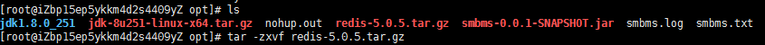

3、进入解压后的文件，可以看到我们redis的配置文件

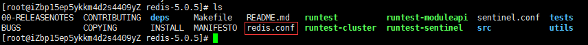

4、基本的环境安装

```shell
yum install gcc-c++
make
make install
```


没报错，说明安装成功！

5、redis的默认安装路径 `/usr/local/bin`

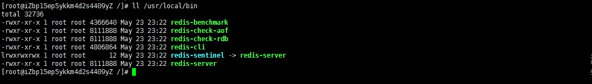

6、将redis配置文件复制到/usr/local/bin/(为了方便)

之后就以这个配置文件的方式启动！

```shell
cp /opt/redis-5.0.5/redis.conf /usr/local/bin/
```

7、redis默认不是后台启动的，修改配置文件！

如果有bind 127.0.0.1,直接#注释掉


8、启动Redis服务！

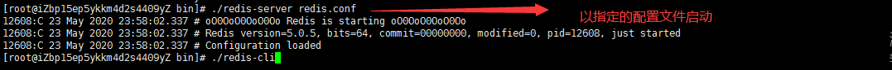

9、使用redis-cli 进行连接测试！

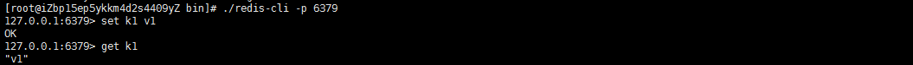

10、查看redis的进程是否开启！


11、如何关闭Redis服务呢？ shutdown

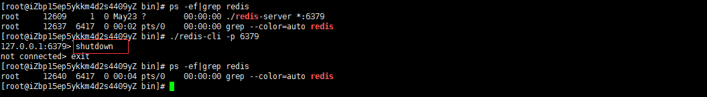

13、后面我们会使用单机多Redis启动集群测试！


## 测试性能

redis-benchmark 是一个压力测试工具！
官方自带的性能测试工具！
redis-benchmark 命令参数！
图片来自菜鸟教程


我们来简单测试下：

 ```bash
# 测试：100个并发连接 100000请求
redis-benchmark -h localhost -p 6379 -c 100 -n 100000
 ```

如何查看这些分析呢？

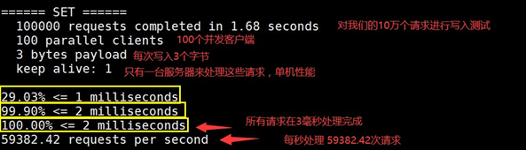


## 基础知识

redis很占内存，需要给linux最大限度地分配内存echo 1 > /proc/sys/vm/overcommit_memory

redis默认有16个数据库

默认使用的是第0个

可以使用 select 进行切换数据库！

```bash
[root@iZbp15ep5ykkm4d2s4409yZ bin]# ./redis-cli -p 6379
127.0.0.1:6379> select 1	#切换数据库
OK
127.0.0.1:6379[1]> DBSIZE 	#查看DB大小
(integer) 0
127.0.0.1:6379> keys *
1) "mylist"
2) "counter:__rand_int__"
3) "k1"
4) "key:__rand_int__"
5) "myset:__rand_int__"
127.0.0.1:6379> flushdb
OK
127.0.0.1:6379> keys *
(empty list or set)
# 清除当前数据库 flushdb
# 清除全部数据库的内容 FLUSHALL
```

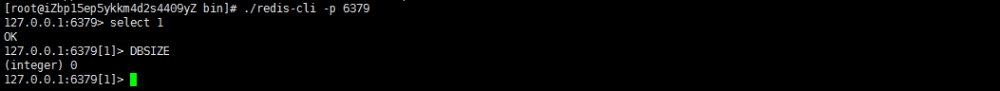


> Redis 是单线程的！

明白Redis是很快的，官方表示，Redis是基于内存操作，CPU不是Redis性能瓶颈，Redis的瓶颈是根据 机器的内存和网络带宽

既然可以使用单线程来实现，就使用单线程了！所有就使用了单线程了！ 

Redis 是C 语言写的，官方提供的数据为 100000+ 的QPS，完全不比同样是使用 key-vale的 Memecache差！

**Redis 为什么单线程还这么快？**

1、误区1：高性能的服务器一定是多线程的？

2、误区2：多线程（CPU上下文会切换！）一定比单线程效率高！

 先去CPU>内存>硬盘的速度要有所了解！

核心：redis 是将所有的数据全部放在内存中的，所以说使用单线程去操作效率就是最高的，多线程 （CPU上下文会切换：耗时的操作！！！），对于内存系统来说，如果没有上下文切换效率就是最高 的！多次读写都是在一个CPU上的，在内存情况下，这个就是最佳的方案！


# 五大数据类型

> 查看官网文档

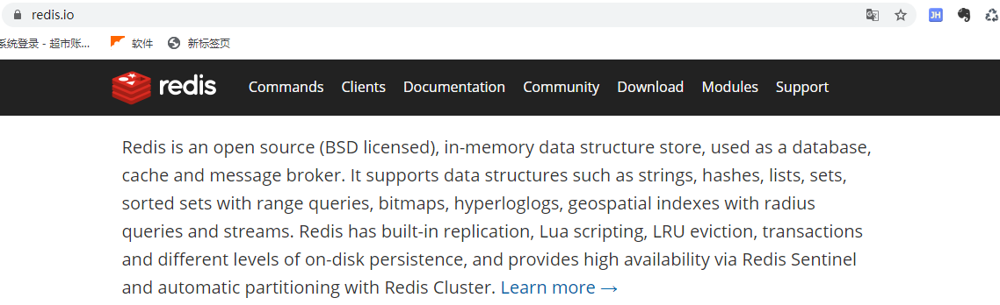

翻译：

​	Redis 是一个开源（BSD许可）的，内存中的数据结构存储系统，它可以用作数据库、缓存和消息中间件。 它支持多种类型的数据结构，如 字符串（strings）， 散列（hashes）， 列表（lists）， 集合（sets）， 有序集合（sorted sets） 与范围查询， bitmaps， hyperloglogs 和 地理空间（geospatial） 索引半径查询。 Redis 内置了 复制（replication），LUA脚本（Lua scripting）， LRU驱动事件（LRU eviction），事务（transactions） 和不同级别的 磁盘持久化（persistence）， 并通过 Redis哨兵（Sentinel）和自动 分区（Cluster）提供高可用性（high availability）。

> 我们现在讲解的所有命令大家一定要全部记住，后面我们使用SpringBoot。Jedis，所有的方法就是 这些命令！ 单点登录


## Redis-Key

```bash
127.0.0.1:6379> keys * 		# 查看所有的key
(empty list or set)
127.0.0.1:6379> set name kuangshen # set key
OK
127.0.0.1:6379> keys *
1) "name"
127.0.0.1:6379> set age 1
OK
127.0.0.1:6379> keys *
1) "age"
2) "name"
127.0.0.1:6379> EXISTS name # 判断当前的key是否存在
(integer) 1
127.0.0.1:6379> EXISTS name1
(integer) 0
127.0.0.1:6379> move name 1 # 将当前的key移动到索引为db的数据库中，del key 命令是删除当前数据库key数据
(integer) 1
127.0.0.1:6379> keys *
1) "age"
127.0.0.1:6379> set name qinjiang
OK
127.0.0.1:6379> keys *
1) "age"
2) "name"
127.0.0.1:6379> keys *
1) "age"
2) "name"
127.0.0.1:6379> get name
"qinjiang"
127.0.0.1:6379> EXPIRE name 10 # 设置key的过期时间，单位是秒
(integer) 1
127.0.0.1:6379> ttl name # 查看当前key的剩余时间
(integer) 4
127.0.0.1:6379> get name
(nil)
127.0.0.1:6379> type name # 查看当前key的一个类型！
string
```

后面如果遇到不会的命令，可以在官网查看帮助文档！


## String（字符串）

90% 的 java程序员使用 redis 只会使用一个String类型！

```bash
#############################################################################
127.0.0.1:6379> keys *			# 获得所有的key	
(empty list or set)
127.0.0.1:6379> set k1 v1		# 设置值
OK
127.0.0.1:6379> get k1			# 获得值
"v1"
127.0.0.1:6379> EXISTS k1		# 判断某一个key是否存在
(integer) 1
127.0.0.1:6379> EXISTS k2
(integer) 0
127.0.0.1:6379> APPEND k1 hello	# 追加字符串，如果当前key不存在，就相当于setkey
(integer) 7
127.0.0.1:6379> get k1
"v1hello"
127.0.0.1:6379> STRLEN k1	# 获取字符串的长度
(integer) 7
127.0.0.1:6379> keys *
1) "k1"
127.0.0.1:6379> APPEND k2 hellok2	# 追加字符串，如果当前key不存在，就相当于setkey
(integer) 7
127.0.0.1:6379> get k2
"hellok2"
#############################################################################
# i++
# 步长 i+=
127.0.0.1:6379> clear
127.0.0.1:6379> set views 0		# 初始浏览量为0
OK
127.0.0.1:6379> INCR views		# 自增1 浏览量变为1
(integer) 1
127.0.0.1:6379> INCR views		# 如果incr的对象不是一个数字，会报错；
                                # 如果超出long long范围，会报错
(integer) 2
127.0.0.1:6379> get views
"2"
127.0.0.1:6379> DECR views		# 自减1 浏览量-1
(integer) 1
127.0.0.1:6379> INCRBY views 5	# 可以设置步长，指定增量！
(integer) 6
127.0.0.1:6379> DECRBY views 3	# 可以设置步长，指定减量！
(integer) 3
127.0.0.1:6379> get views
"3"
#############################################################################
# 字符串范围 range
127.0.0.1:6379> set key1 "hello" # 设置 key1 的值
OK
127.0.0.1:6379> get key1
"hello"
127.0.0.1:6379> GETRANGE key1 0 3 # 截取字符串 [0,3]
"hell"
127.0.0.1:6379> GETRANGE key1 0 -1 # 获取全部的字符串 和 get key是一样的
"hello"
# 替换！
127.0.0.1:6379> set key2 abcdefg
OK
127.0.0.1:6379> get key2
"abcdefg"
127.0.0.1:6379> SETRANGE key2 1 xx # 替换指定位置开始的字符串！
(integer) 7
127.0.0.1:6379> get key2
"axxdefg"
#############################################################################
# setex (set with expire) # 设置过期时间
# setnx (set if not exist) # 不存在在设置 （在分布式锁中会常常使用！）
127.0.0.1:6379> setex key3 30 "hello" # 设置key3 的值为 hello,30秒后过期
OK
127.0.0.1:6379> ttl key3
(integer) 26
127.0.0.1:6379> get key3
"hello"
127.0.0.1:6379> setnx mykey "redis" # 如果mykey 不存在，创建mykey
(integer) 1
127.0.0.1:6379> keys *
1) "key2"
2) "mykey"
3) "key1"
127.0.0.1:6379> ttl key3
(integer) -2
127.0.0.1:6379> setnx mykey "MongoDB" # 如果mykey存在，创建失败！
(integer) 0
127.0.0.1:6379> get mykey
"redis"
#############################################################################
# mset
# mget
127.0.0.1:6379> mset k1 v1 k2 v2 k3 v3 # 同时设置多个值
OK
127.0.0.1:6379> keys *
1) "k1"
2) "k2"
3) "k3"
127.0.0.1:6379> mget k1 k2 k3 # 同时获取多个值
1) "v1"
2) "v2"
3) "v3"
127.0.0.1:6379> msetnx k1 v1 k4 v4 # msetnx 是一个原子性的操作，要么一起成功，要么一起失败！
(integer) 0
127.0.0.1:6379> get k4
(nil)
#############################################################################
# 对象
set user:1 {name:zhangsan,age:3} # 设置一个user:1 对象 值为 json字符来保存一个对象！
# 这里的key是一个巧妙的设计： user:{id}:{filed} , 如此设计在Redis中是完全OK了！
127.0.0.1:6379> mset user:1:name zhangsan user:1:age 2
OK
127.0.0.1:6379> mget user:1:name user:1:age
1) "zhangsan"
2) "2"
##########################################################################
# getset  先get然后在set
127.0.0.1:6379> getset db redis # 如果不存在值，则返回 nil
(nil)
127.0.0.1:6379> get db
"redis
127.0.0.1:6379> getset db mongodb # 如果存在值，获取原来的值，并设置新的值
"redis"
127.0.0.1:6379> get db
"mongodb"
```

数据结构是相同的！

String类似的使用场景：value除了是我们的字符串还可以是我们的数字！

+ 计数器 

+ 统计多单位的数量 

+ 粉丝数 

+ 对象缓存存储


## List（列表）

基本的数据类型，列表 

图一：


在redis里面，我们可以把list玩成栈、队列、阻塞队列！ 

**所有的list命令都是用l开头的**，Redis的命令不区分大小

> 演示案例


```bash
# 案例一：LPUSH将一个值或多个值插入到列表的头部(图一的左边插入）)
127.0.0.1:6379> flushdb		#避免干扰，先清空当前数据库
OK
127.0.0.1:6379> keys *
(empty array)
127.0.0.1:6379> LPUSH list one			# 将一个值或多个值插入到列表的头部（左）
(integer) 1
127.0.0.1:6379> LPUSH list two			# key=list,value=two
(integer) 2
127.0.0.1:6379> LPUSH list three		# key=list,value=three
(integer) 3
127.0.0.1:6379> LRANGE list 0 -1		#（L从左边）取出key=list的所有值，先取的three，说明该List可以玩成栈的结构
1) "three"
2) "two"
3) "one"
127.0.0.1:6379> LRANGE list 0 1			#（L从左边）取出key=list索引为[0,1]的值
1) "three"
2) "two"
127.0.0.1:6379> RPUSH list right		# 将一个值或多个值插入到列表的尾部（右）
(integer) 4
127.0.0.1:6379> LRANGE list 0 -1		#（L从左边）取出列表名为list的所有值
1) "three"
2) "two"
3) "one"
4) "right"
```


```bash
# Lpop Rpop
127.0.0.1:6379> LRANGE list 0 -1
1) "three"
2) "two"
3) "one"
4) "right"
127.0.0.1:6379> LPOP list			# 移除list的第一个元素
"three"
127.0.0.1:6379> RPOP list			# 移除list的最后一个元素
"right"
127.0.0.1:6379> LRANGE list 0 -1
1) "two"
2) "one"
#####################################################################
# Lindex 通过下标获取List的某个值
# Llen 判断List的长度
127.0.0.1:6379> LINDEX list 1
"one"
127.0.0.1:6379> LINDEX list 0
"two"
127.0.0.1:6379>  Llen list
(integer) 2
##################################################################
# Lrem key count element 移除指定的值
127.0.0.1:6379> LRANGE list 0 -1
1) "two"
2) "one"
127.0.0.1:6379> LPUSH list two
(integer) 3
127.0.0.1:6379> LRANGE list 0 -1		# List允许重复值
1) "two"
2) "two"
3) "one"
127.0.0.1:6379> LREM list 1 one			# 从头到尾移除掉list的一个two
(integer) 1
127.0.0.1:6379> LRANGE list 0 -1
1) "two"
2) "two"
127.0.0.1:6379> LREM list 2 two			#移除list中的掉两个two
(integer) 2
127.0.0.1:6379> LRANGE list 0 -1
(empty array)
```


```bash
# trim 修剪
127.0.0.1:6379> keys *
(empty list or set)
127.0.0.1:6379> Rpush mylist "hello"
(integer) 1
127.0.0.1:6379> Rpush mylist "hello1"
(integer) 2
127.0.0.1:6379> Rpush mylist "hello2"
(integer) 3
127.0.0.1:6379> Rpush mylist "hello3"
(integer) 4
127.0.0.1:6379> ltrim mylist 1 2 # 通过下标截取指定的长度，这个List已经被改变了，截断了只剩下截取的元素！
OK
127.0.0.1:6379> LRANGE mylist 0 -1
1) "hello1"
2) "hello2"
#########################################################################
rpoplpush # 移除列表的最后一个元素，将他移动到新的列表中！
127.0.0.1:6379> rpush mylist "hello"
(integer) 1
127.0.0.1:6379> rpush mylist "hello1"
(integer) 2
127.0.0.1:6379> rpush mylist "hello2"
(integer) 3
127.0.0.1:6379> rpoplpush mylist myotherlist # 移除列表的最后一个元素，将他移动到新的
列表中！
"hello2"
127.0.0.1:6379> lrange mylist 0 -1 # 查看原来的列表
1) "hello"
2) "hello1"
127.0.0.1:6379> lrange myotherlist 0 -1 # 查看目标列表中，确实存在改值！
1) "hello2"
```


```bash
# lset 将列表中指定下标的值替换为另外一个值，更新操作
127.0.0.1:6379> EXISTS list # 判断这个列表是否存在
(integer) 0
127.0.0.1:6379> lset list 0 item # 如果不存在列表我们去更新就会报错
(error) ERR no such key
127.0.0.1:6379> lpush list value1
(integer) 1
127.0.0.1:6379> LRANGE list 0 0
1) "value1"
127.0.0.1:6379> lset list 0 item # 如果存在，更新当前下标的值
OK
127.0.0.1:6379> LRANGE list 0 0
1) "item"
127.0.0.1:6379> lset list 1 other # 如果不存在，则会报错！
(error) ERR index out of range
#########################################################################
linsert # 将某个具体的value插入到列把你中某个元素的前面或者后面！
127.0.0.1:6379> Rpush mylist "hello"
(integer) 1
127.0.0.1:6379> Rpush mylist "world"
(integer) 2
127.0.0.1:6379> LINSERT mylist before "world" "other"
(integer) 3
127.0.0.1:6379> LRANGE mylist 0 -1
1) "hello"
2) "other"
3) "world"
127.0.0.1:6379> LINSERT mylist after world new
(integer) 4
127.0.0.1:6379> LRANGE mylist 0 -1
1) "hello"
2) "other"
3) "world"
4) "new"
```

> 小结

- 他实际上是一个链表，before Node after ， left，right 都可以插入值
- 如果key 不存在，创建新的链表
- 如果key存在，新增内容
- 如果移除了所有值，空链表，也代表不存在！ 
- 在两边插入或者改动值，效率最高！ 中间元素，相对来说效率会低一点~

消息排队！消息队列 （Lpush Rpop）， 栈（ Lpush Lpop）！


## Set（集合）

set中的值是不能重读的！

```bash
##########################################################################
127.0.0.1:6379> sadd myset "hello" # set集合中添加元素
(integer) 1
127.0.0.1:6379> sadd myset "kuangshen"
(integer) 1
127.0.0.1:6379> sadd myset "lovekuangshen"
(integer) 1
127.0.0.1:6379> SMEMBERS myset # 查看指定set的所有值
1) "hello"
2) "lovekuangshen"
3) "kuangshen"
127.0.0.1:6379> SISMEMBER myset hello # 判断某一个值是不是在set集合中！
(integer) 1
127.0.0.1:6379> SISMEMBER myset world
(integer) 0
##########################################################################
127.0.0.1:6379> scard myset # 获取set集合中的内容元素个数！
(integer) 4
##########################################################################
rem
127.0.0.1:6379> srem myset hello # 移除set集合中的指定元素
(integer) 1
127.0.0.1:6379> scard myset
(integer) 3
127.0.0.1:6379> SMEMBERS myset
1) "lovekuangshen2"
2) "lovekuangshen"
3) "kuangshen"
##########################################################################
set 无序不重复集合。抽随机！
127.0.0.1:6379> SMEMBERS myset
1) "lovekuangshen2"
2) "lovekuangshen"
3) "kuangshen"
127.0.0.1:6379> SRANDMEMBER myset # 随机抽选出一个元素
"kuangshen"
127.0.0.1:6379> SRANDMEMBER myset
"kuangshen"
127.0.0.1:6379> SRANDMEMBER myset
"kuangshen"
127.0.0.1:6379> SRANDMEMBER myset
"kuangshen"
127.0.0.1:6379> SRANDMEMBER myset 2 # 随机抽选出指定个数的元素
1) "lovekuangshen"
2) "lovekuangshen2"
127.0.0.1:6379> SRANDMEMBER myset 2
1) "lovekuangshen"
2) "lovekuangshen2"
127.0.0.1:6379> SRANDMEMBER myset # 随机抽选出一个元素
"lovekuangshen2"
##########################################################################
删除定的key，随机删除key！
127.0.0.1:6379> SMEMBERS myset
1) "lovekuangshen2"
2) "lovekuangshen"
3) "kuangshen"
127.0.0.1:6379> spop myset # 随机删除一些set集合中的元素！
"lovekuangshen2"
127.0.0.1:6379> spop myset
"lovekuangshen"
127.0.0.1:6379> SMEMBERS myset
1) "kuangshen"
##########################################################################
将一个指定的值，移动到另外一个set集合！
127.0.0.1:6379> sadd myset "hello"
(integer) 1
127.0.0.1:6379> sadd myset "world"
(integer) 1
127.0.0.1:6379> sadd myset "kuangshen"
(integer) 1
127.0.0.1:6379> sadd myset2 "set2"
(integer) 1
127.0.0.1:6379> smove myset myset2 "kuangshen" # 将一个指定的值，移动到另外一个set集
合！
(integer) 1
127.0.0.1:6379> SMEMBERS myset
1) "world"
2) "hello"
127.0.0.1:6379> SMEMBERS myset2
1) "kuangshen"
2) "set2"
##########################################################################
微博，B站，共同关注！(并集)
数字集合类：
- 差集 SDIFF
- 交集 SINTER
- 并集 SUNION
127.0.0.1:6379> SDIFF key1 key2 # 差集
1) "b"
2) "a"
127.0.0.1:6379> SINTER key1 key2 # 交集 共同好友就可以这样实现
1) "c"
127.0.0.1:6379> SUNION key1 key2 # 并集
1) "b"
2) "c"
3) "e"
4) "a"
5) "d"
```

微博，A用户将所有关注的人放在一个set集合中！将它的粉丝也放在一个集合中！ 共同关注，共同爱好，二度好友，推荐好友！（六度分割理论）


## Hash

Map集合，key-map! 时候这个值是一个map集合！ 本质和String类型没有太大区别，还是一个简单的 key-value！ 

set myhash field kuangshen

```bash
##########################################################################
127.0.0.1:6379> hset myhash field1 kuangshen # set一个具体 key-vlaue
(integer) 1
127.0.0.1:6379> hget myhash field1 # 获取一个字段值
"kuangshen"
127.0.0.1:6379> hmset myhash field1 hello field2 world # set多个 key-vlaue
OK
127.0.0.1:6379> hmget myhash field1 field2 # 获取多个字段值
1) "hello"
2) "world"
127.0.0.1:6379> hgetall myhash # 获取全部的数据，
1) "field1"
2) "hello"
3) "field2"
4) "world"
127.0.0.1:6379> hdel myhash field1 # 删除hash指定key字段！对应的value值也就消失了！
(integer) 1
127.0.0.1:6379> hgetall myhash
1) "field2"
2) "world"
##########################################################################
hlen
127.0.0.1:6379> hmset myhash field1 hello field2 world
OK
127.0.0.1:6379> HGETALL myhash
1) "field2"
2) "world"
3) "field1"
4) "hello"
127.0.0.1:6379> hlen myhash # 获取hash表的字段数量！
(integer) 2
##########################################################################
127.0.0.1:6379> HEXISTS myhash field1 # 判断hash中指定字段是否存在！
(integer) 1
127.0.0.1:6379> HEXISTS myhash field3
(integer) 0
##########################################################################
# 只获得所有field
# 只获得所有value
127.0.0.1:6379> hkeys myhash # 只获得所有field
1) "field2"
2) "field1"
127.0.0.1:6379> hvals myhash # 只获得所有value
1) "world"
2) "hello"
##########################################################################
incr decr
127.0.0.1:6379> hset myhash field3 5 #指定增量！
(integer) 1
127.0.0.1:6379> HINCRBY myhash field3 1
(integer) 6
127.0.0.1:6379> HINCRBY myhash field3 -1
(integer) 5
127.0.0.1:6379> hsetnx myhash field4 hello # 如果不存在则可以设置
(integer) 1
127.0.0.1:6379> hsetnx myhash field4 world # 如果存在则不能设置
(integer) 0
```

hash变更的数据 user name age,尤其是是用户信息之类的，经常变动的信息！ hash 更适合于对象的 存储，String更加适合字符串存储！


## Zset（有序集合）

在set的基础上，增加了一个值，set k1 v1 zset k1 score1 v1

```bash
127.0.0.1:6379> zadd myset 1 one # 添加一个值
(integer) 1
127.0.0.1:6379> zadd myset 2 two 3 three # 添加多个值
(integer) 2
127.0.0.1:6379> ZRANGE myset 0 -1
1) "one"
2) "two"
3) "three"
##########################################################################
排序如何实现
127.0.0.1:6379> zadd salary 2500 xiaohong # 添加三个用户
(integer) 1
127.0.0.1:6379> zadd salary 5000 zhangsan
(integer) 1
127.0.0.1:6379> zadd salary 500 kaungshen
(integer) 1
# ZRANGEBYSCORE key min max
127.0.0.1:6379> ZRANGEBYSCORE salary -inf +inf # 显示全部的用户 从小到大！
1) "kaungshen"
2) "xiaohong"
3) "zhangsan"
127.0.0.1:6379> ZREVRANGE salary 0 -1 # 从大到进行排序！
1) "zhangsan"
2) "kaungshen"
127.0.0.1:6379> ZRANGEBYSCORE salary -inf +inf withscores # 显示全部的用户并且附带成绩
1) "kaungshen"
2) "500"
3) "xiaohong"
4) "2500"
5) "zhangsan"
6) "5000"
127.0.0.1:6379> ZRANGEBYSCORE salary -inf 2500 withscores # 显示工资小于2500员工的升序排序！
1) "kaungshen"
2) "500"
3) "xiaohong"
4) "2500"
##########################################################################
# 移除rem中的元素
127.0.0.1:6379> zrange salary 0 -1
1) "kaungshen"
2) "xiaohong"
3) "zhangsan"
127.0.0.1:6379> zrem salary xiaohong # 移除有序集合中的指定元素
(integer) 1
127.0.0.1:6379> zrange salary 0 -1
1) "kaungshen"
2) "zhangsan"
127.0.0.1:6379> zcard salary # 获取有序集合中的个数
(integer) 2
##########################################################################
127.0.0.1:6379> zadd myset 1 hello
(integer) 1
127.0.0.1:6379> zadd myset 2 world 3 kuangshen
(integer) 2
127.0.0.1:6379> zcount myset 1 3 # 获取指定区间的成员数量！
(integer) 3
127.0.0.1:6379> zcount myset 1 2
(integer) 2
```

其余的一些API，通过我们的学习，你们剩下的如果工作中有需要，这个时候你可以去查看官方文档！ 

案例思路：set 排序 存储班级成绩表，工资表排序！ 普通消息，1， 重要消息 2，带权重进行判断！ 

排行榜应用实现，取Top N 测试！


# 三种特殊数据类型

## Geospatial 地理位置

朋友的定位，附近的人，打车距离计算？

Redis 的 Geo 在Redis3.2 版本就推出了！这个功能可以推算地理位置的信息，两地之间的距离，方圆几里的人！

可以查询一些测试数据：http://www.jsons.cn/lngcodeinfo/0706D99C19A781A3/

只有六个命令：


官方文档：https://www.redis.net.cn/order/3685.html

> getadd

```bash
# getadd 添加地理位置
# 规则：两级无法直接添加，我们一般会下载城市数据，直接通过java程序一次性导入！
# 有效的经度从-180度到180度。
# 有效的纬度从-85.05112878度到85.05112878度。
# 当坐标位置超出上述指定范围时，该命令将会返回一个错误。
# 127.0.0.1:6379> geoadd china:city 39.90 116.40 beijin
(error) ERR invalid longitude,latitude pair 39.900000,116.400000
# 参数 key 值（）
127.0.0.1:6379> geoadd china:city 116.40 39.90 beijing
(integer) 1
127.0.0.1:6379> geoadd china:city 121.47 31.23 shanghai
(integer) 1
127.0.0.1:6379> geoadd china:city 106.50 29.53 chongqi 114.05 22.52 shengzhen
(integer) 2
127.0.0.1:6379> geoadd china:city 120.16 30.24 hangzhou 108.96 34.26 xian
(integer) 2
```

> getpos

获得当前定位：一定是一个坐标值！

```bash
127.0.0.1:6379> GEOPOS china:city beijing # 获取指定的城市的经度和纬度！
1) 1) "116.39999896287918091"
2) "39.90000009167092543"
127.0.0.1:6379> GEOPOS china:city beijing chongqi
1) 1) "116.39999896287918091"
2) "39.90000009167092543"
2) 1) "106.49999767541885376"
2) "29.52999957900659211"
```

> GEODIST

两人之间的距离！ 单位： m 表示单位为米。 km 表示单位为千米。 mi 表示单位为英里。 ft 表示单位为英尺。

```bash
127.0.0.1:6379> GEODIST china:city beijing shanghai km # 查看上海到北京的直线距离
"1067.3788"
127.0.0.1:6379> GEODIST china:city beijing chongqi km # 查看重庆到北京的直线距离
"1464.0708"
```

> georadius 以给定的经纬度为中心， 找出某一半径内的元素

我附近的人？ （获得所有附近的人的地址，定位！）通过半径来查询！

获得指定数量的人，200

所有数据应该都录入：china:city ，才会让结果更加请求！

```bash
127.0.0.1:6379> GEORADIUS china:city 110 30 1000 km # 以110，30 这个经纬度为中心，寻找方圆1000km内的城市
1) "chongqi"
2) "xian"
3) "shengzhen"
4) "hangzhou"
127.0.0.1:6379> GEORADIUS china:city 110 30 500 km
1) "chongqi"
2) "xian"
127.0.0.1:6379> GEORADIUS china:city 110 30 500 km withdist # 显示到中间距离的位置
1) 1) "chongqi"
2) "341.9374"
2) 1) "xian"
2) "483.8340"
127.0.0.1:6379> GEORADIUS china:city 110 30 500 km withcoord # 显示他人的定位信息
1) 1) "chongqi"
2) 1) "106.49999767541885376"
2) "29.52999957900659211"
2) 1) "xian"
2) 1) "108.96000176668167114"
2) "34.25999964418929977"
127.0.0.1:6379> GEORADIUS china:city 110 30 500 km withdist withcoord count 1 #
筛选出指定的结果！
1) 1) "chongqi"
2) "341.9374"
3) 1) "106.49999767541885376"
2) "29.52999957900659211"
127.0.0.1:6379> GEORADIUS china:city 110 30 500 km withdist withcoord count 2
1) 1) "chongqi"
2) "341.9374"
3) 1) "106.49999767541885376"
2) "29.52999957900659211"
2) 1) "xian"
2) "483.8340"
3) 1) "108.96000176668167114"
2) "34.25999964418929977"
```

> GEORADIUSBYMEMBER

```bash
# 找出位于指定元素周围的其他元素！
127.0.0.1:6379> GEORADIUSBYMEMBER china:city beijing 1000 km
1) "beijing"
2) "xian"
127.0.0.1:6379> GEORADIUSBYMEMBER china:city shanghai 400 km
1) "hangzhou"
2) "shanghai"
```

> GEOHASH 命令 - 返回一个或多个位置元素的 Geohash 表示

该命令将返回11个字符的Geohash字符串!

```bash
# 将二维的经纬度转换为一维的字符串，如果两个字符串越接近，那么则距离越近！
127.0.0.1:6379> geohash china:city beijing chongqi
1) "wx4fbxxfke0"
2) "wm5xzrybty0"
```

> GEO 底层的实现原理其实就是 Zset！我们可以使用Zset命令来操作geo！

```bash
127.0.0.1:6379> ZRANGE china:city 0 -1 # 查看地图中全部的元素
1) "chongqi"
2) "xian"
3) "shengzhen"
4) "hangzhou"
5) "shanghai"
6) "beijing"
127.0.0.1:6379> zrem china:city beijing # 移除指定元素！
(integer) 1
127.0.0.1:6379> ZRANGE china:city 0 -1
1) "chongqi"
2) "xian"
3) "shengzhen"
4) "hangzhou"
5) "shanghai"
```


## Hyperloglog

> 什么是基数？

A {1,3,5,7,8,7} 

B{1,3,5,7,8}

基数（不重复的元素） = 5，可以接受误差！

> 简介

Redis 2.8.9 版本就更新了 Hyperloglog 数据结构！ 

Redis Hyperloglog 基数统计的算法！

优点：占用的内存是固定，2^64 不同的元素的技术，只需要废 12KB内存！如果要从内存角度来比较的 话 Hyperloglog 首选！

网页的 UV （即页面浏览量，一个人访问一个网站多次，但是还是算作一个人！） 

传统的方式， set 保存用户的id，然后就可以统计 set 中的元素数量作为标准判断 ! 这个方式如果保存大量的用户id，就会比较麻烦！我们的目的是为了计数，而不是保存用户id； 0.81% 错误率！ 统计UV任务，可以忽略不计的！

> 测试使用

```bash
127.0.0.1:6379> PFadd mykey a b c d e f g h i j # 创建第一组元素 mykey 
(integer) 1
127.0.0.1:6379> PFCOUNT mykey # 统计 mykey 元素的基数数量
(integer) 10
127.0.0.1:6379> PFadd mykey2 i j z x c v b n m # 创建第二组元素 mykey2
(integer) 1
127.0.0.1:6379> PFCOUNT mykey2
(integer) 9
127.0.0.1:6379> PFMERGE mykey3 mykey mykey2 # 合并两组 mykey mykey2 => mykey3 并集
OK
127.0.0.1:6379> PFCOUNT mykey3 # 看并集的数量！
(integer) 15
```

如果允许容错，那么一定可以使用 Hyperloglog ！

如果不允许容错，就使用 set 或者自己的数据类型即可

每个用户登录进来就可以用PFadd放进来，它不会重复统计。

## Bitmap

为什么其他教程都不喜欢讲这些？这些在生活中或者开发中，都有十分多的应用场景，学习了，就是多一个思路！

> 位存储

统计用户信息，活跃，不活跃！ 登录 、 未登录！ 打卡，365打卡！ 两个状态的，都可以使用 Bitmaps！

Bitmap 位图，数据结构！ 都是操作二进制位来进行记录，就只有0 和 1 两个状态！ 365 天 = 365 bit 1字节 = 8bit 46 个字节左右！

> 测试


使用bitmap 来记录周一到周日的打卡！周一：1   周二：0  周三：0  周四：1 ......

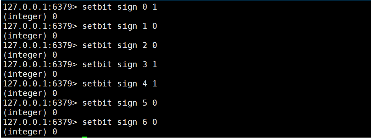

查看某一天是否有打卡！

```bash
127.0.0.1:6379> getbit sign 3
(integer) 1
127.0.0.1:6379> getbit sign 6
(integer) 0
```

统计操作，统计打卡的天数！

```
127.0.0.1:6379> bitcount sign  # 统计这周的打卡记录，就可以看到是否有全勤！
(integer) 3
```


# 事务

Redis 事务本质：一组命令的集合！ 一个事务中的所有命令都会被序列化，在事务执行过程的中，会按

照顺序执行！

一次性、顺序性、排他性！执行一些列的命令！

```
------ 队列 set set set 执行------
```

Redis事务没有隔离级别的概念！

所有的命令在事务中，并没有直接被执行！只有发起执行命令的时候才会执行！Exec

Redis单条命令式保存原子性的，但是事务不保证原子性！

redis的事务：

- 开启事务（multi）
- 命令入队（......）
- 执行事务（exec）

> 正常执行事务！

```bash
127.0.0.1:6379> multi # 开启事务
OK
# 命令入队
127.0.0.1:6379> set k1 v1
QUEUED
127.0.0.1:6379> set k2 v2
QUEUED
127.0.0.1:6379> get k2
QUEUED
127.0.0.1:6379> set k3 v3
QUEUED
127.0.0.1:6379> exec # 执行事务
1) OK
2) OK
3) "v2"
4) OK
```

tips：当命令执行完，事务就结束了。每次想使用事务都要重新开启事务。


> 放弃事务！

```bash
127.0.0.1:6379> multi # 开启事务
OK
127.0.0.1:6379> set k1 v1
QUEUED
127.0.0.1:6379> set k2 v2
QUEUED
127.0.0.1:6379> set k4 v4
QUEUED
127.0.0.1:6379> DISCARD # 取消事务
OK
127.0.0.1:6379> get k4 # 事务队列中命令都不会被执行！
(nil)
```

> 编译型异常（代码有问题！ 命令有错！） ，事务中所有的命令都不会被执行！

```bash
127.0.0.1:6379> multi
OK
127.0.0.1:6379> set k1 v1
QUEUED
127.0.0.1:6379> set k2 v2
QUEUED
127.0.0.1:6379> set k3 v3
QUEUED
127.0.0.1:6379> getset k3 # 错误的命令
(error) ERR wrong number of arguments for 'getset' command
127.0.0.1:6379> set k4 v4
QUEUED
127.0.0.1:6379> set k5 v5
QUEUED
127.0.0.1:6379> exec # 执行事务报错！
(error) EXECABORT Transaction discarded because of previous errors.
127.0.0.1:6379> get k5 # 所有的命令都不会被执行！
(nil)
```

> 运行时异常（1/0）， 如果事务队列中存在语法性，那么执行命令的时候，其他命令是可以正常执行 的，错误命令抛出异常！

```bash
127.0.0.1:6379> set k1 "v1"
OK
127.0.0.1:6379> multi
OK
127.0.0.1:6379> incr k1 # 会执行的时候失败！
QUEUED
127.0.0.1:6379> set k2 v2
QUEUED
127.0.0.1:6379> set k3 v3
QUEUED
127.0.0.1:6379> get k3
QUEUED
127.0.0.1:6379> exec
1) (error) ERR value is not an integer or out of range # 虽然第一条命令报错了，但是依旧正常执行成功了！
2) OK
3) OK
4) "v3"
127.0.0.1:6379> get k2
"v2"
127.0.0.1:6379> get k3
"v3"
```

> 监控！ Watch （面试常问！）

**悲观锁：**

很悲观，认为什么时候都会出问题，无论做什么都会加锁！

**乐观锁：**

- 很乐观，认为什么时候都不会出问题，所以不会上锁！ 更新数据的时候去判断一下，在此期间是否有人修改过这个数据，
- 获取version
- 更新的时候比较 version

> Redis测监视测试 

正常执行成功！

```bash
127.0.0.1:6379> set money 100
OK
127.0.0.1:6379> set out 0
OK
127.0.0.1:6379> watch money # 监视 money 对象
OK
127.0.0.1:6379> multi # 事务正常结束，数据期间没有发生变动，这个时候就正常执行成功！
OK
127.0.0.1:6379> DECRBY money 20
QUEUED
127.0.0.1:6379> INCRBY out 20
QUEUED
127.0.0.1:6379> exec
1) (integer) 80
2) (integer) 20
```

测试多线程修改值 , 使用watch 可以当做redis的乐观锁操作！

```bash
127.0.0.1:6379> watch money # 监视 money
OK
127.0.0.1:6379> multi
OK
127.0.0.1:6379> DECRBY money 10
QUEUED
127.0.0.1:6379> INCRBY out 10
QUEUED
127.0.0.1:6379> exec # 执行之前，另外一个线程，修改了我们的值，这个时候，就会导致事务执行失败！
(nil)
```

如果修改失败，获取最新的值就好

有图


# Jedis

我们要使用 Java 来操作 Redis，知其然并知其所以然，授人以渔！ 学习不能急躁，慢慢来会很快！

> 什么是Jedis?是Redis 官方推荐的 java连接开发工具！ 使用Java 操作Redis 中间件！如果你要使用 java操作redis，那么一定要对Jedis 十分的熟悉！

> 测试

1、导入对应的依赖

```bash
<!--导入jedis的包-->
<dependencies>
<!-- https://mvnrepository.com/artifact/redis.clients/jedis -->
<dependency>
<groupId>redis.clients</groupId>
<artifactId>jedis</artifactId>
<version>3.2.0</version>
</dependency>
<!--fastjson-->
<dependency>
<groupId>com.alibaba</groupId>
<artifactId>fastjson</artifactId>
<version>1.2.62</version>
</dependency>
</dependencies>
```

Redis是Key-Value型内存数据库,不能直接存储对象，可以存json字符串。所以需要使用json进行中转


2、编码测试： 连接数据库 操作命令 断开连接！

```java
package com.kuang;
import redis.clients.jedis.Jedis;
public class TestPing {
public static void main(String[] args) {
// 1、 new Jedis 对象即可
Jedis jedis = new Jedis("127.0.0.1",6379);
// jedis 所有的命令就是我们之前学习的所有指令！所以之前的指令学习很重要！
System.out.println(jedis.ping());
	}
}
```

输出：pong

## 常用的API

String

List

Set

Hash

Zset

> 所有的api命令，就是我们对应的上面学习的指令，一个都没有变化！

> 事务

```java
public class TestTX {
public static void main(String[] args) {
Jedis jedis = new Jedis("127.0.0.1", 6379);
jedis.flushDB();
JSONObject jsonObject = new JSONObject();
jsonObject.put("hello","world");
jsonObject.put("name","kuangshen");
// 开启事务
Transaction multi = jedis.multi();
String result = jsonObject.toJSONString();
// jedis.watch(result)
try {
multi.set("user1",result);
multi.set("user2",result);
int i = 1/0 ; // 代码抛出异常事务，执行失败！
multi.exec(); // 执行事务！
} catch (Exception e) {
multi.discard(); // 放弃事务
e.printStackTrace();
} finally {
System.out.println(jedis.get("user1"));
System.out.println(jedis.get("user2"));
jedis.close(); // 关闭连接
}
}
}
```

# SpringBoot整合

SpringBoot 操作数据：spring-data jpa jdbc mongodb redis！

SpringData 也是和 SpringBoot 齐名的项目！

说明： 在 SpringBoot2.x 之后，原来使用的jedis 被替换为了 lettuce?

jedis : 采用的直连，多个线程操作的话，是不安全的，如果想要避免不安全的，使用 jedis pool 连接

池！ 更像 BIO 模式

lettuce : 采用netty，实例可以再多个线程中进行共享，不存在线程不安全的情况！可以减少线程数据

了，更像 NIO 模式

源码分析：

```java
@Bean
@ConditionalOnMissingBean(name = "redisTemplate") // 我们可以自己定义一个
redisTemplate来替换这个默认的！
public RedisTemplate<Object, Object> redisTemplate(RedisConnectionFactory
redisConnectionFactory)
throws UnknownHostException {
// 默认的 RedisTemplate 没有过多的设置，redis 对象都是需要序列化！
// 两个泛型都是 Object, Object 的类型，我们后使用需要强制转换 <String, Object>
RedisTemplate<Object, Object> template = new RedisTemplate<>();
template.setConnectionFactory(redisConnectionFactory);
return template;
}
@Bean
@ConditionalOnMissingBean // 由于 String 是redis中最常使用的类型，所以说单独提出来了一
个bean！
public StringRedisTemplate stringRedisTemplate(RedisConnectionFactory
redisConnectionFactory)
throws UnknownHostException {
StringRedisTemplate template = new StringRedisTemplate();
template.setConnectionFactory(redisConnectionFactory);
return template;
}
```

> 整合测试一下

1、导入依赖

```xml
<!-- 操作redis -->
<dependency>
<groupId>org.springframework.boot</groupId>
<artifactId>spring-boot-starter-data-redis</artifactId>
</dependency>
```

2、配置连接

```
# 配置redis
spring.redis.host=127.0.0.1
spring.redis.port=6379
```

3、测试！

```java
@SpringBootTest
class Redis02SpringbootApplicationTests {
@Autowired
private RedisTemplate redisTemplate;
@Test
void contextLoads() {
// redisTemplate 操作不同的数据类型，api和我们的指令是一样的
// opsForValue 操作字符串 类似String
// opsForList 操作List 类似List
// opsForSet
// opsForHash
// opsForZSet
// opsForGeo
// opsForHyperLogLog
// 除了进本的操作，我们常用的方法都可以直接通过redisTemplate操作，比如事务，和基本的
CRUD
// 获取redis的连接对象
// RedisConnection connection =
redisTemplate.getConnectionFactory().getConnection();
// connection.flushDb();
// connection.flushAll();
redisTemplate.opsForValue().set("mykey","关注狂神说公众号");
System.out.println(redisTemplate.opsForValue().get("mykey"));
}
}
```

关于对象的保存：

我们来编写一个自己的 RedisTemplete

```css
package com.kuang.config;
```

```css
import com.fasterxml.jackson.annotation.JsonAutoDetect;
import com.fasterxml.jackson.annotation.PropertyAccessor;
import com.fasterxml.jackson.databind.ObjectMapper;
import org.springframework.context.annotation.Bean;
import org.springframework.context.annotation.Configuration;
import org.springframework.data.redis.connection.RedisConnectionFactory;
import org.springframework.data.redis.core.RedisTemplate;
import org.springframework.data.redis.serializer.Jackson2JsonRedisSerializer;
import org.springframework.data.redis.serializer.StringRedisSerializer;
```

```java
@Configuration
public class RedisConfig {
```

所有的redis操作，其实对于java开发人员来说，十分的简单，更重要是要去理解redis的思想和每一种数
 据结构的用处和作用场景！