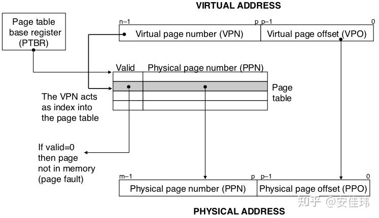
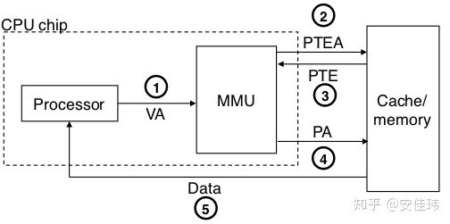
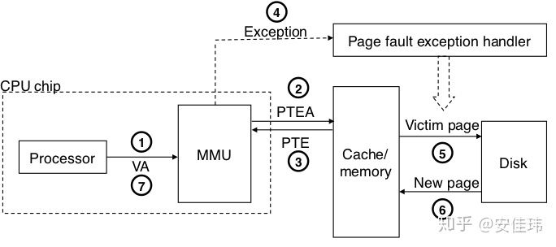
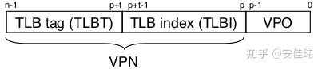
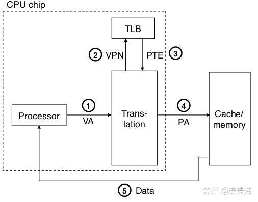
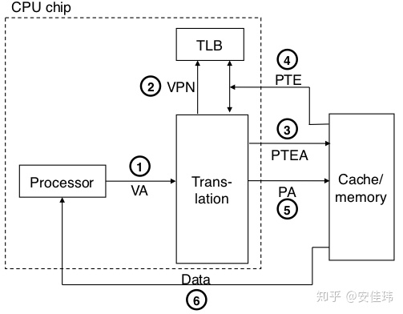
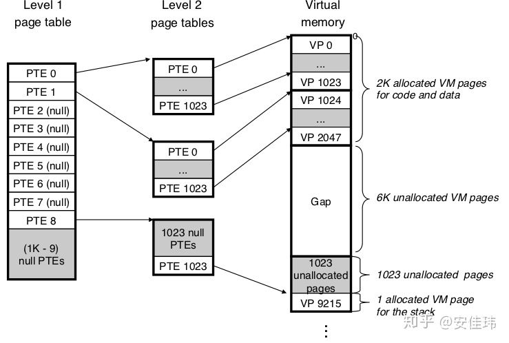
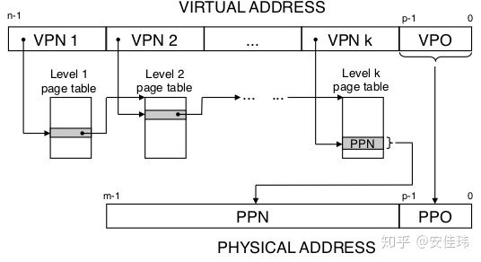

# 深入了解虚拟内存（Virtual Memory）

​	我们应该知道**物理内存（Physical Memory）**指的是硬件上的内存，即 RAM。它通常指的是插在主板上的内存条，给进程提供临时数据存储的设备。因为 CPU 可以直接从物理内存中读取数据和指令，所以物理内存又叫做**主存**。

​	**虚拟内存（virtual memory，VM）**又叫做**虚拟存储（virtual storage)**，是一种内存管理技术。它是操作系统提供的一种对主存的抽象。虚拟内存的实现由操作系统软件和硬件结合完成，包括硬件异常、地址翻译、磁盘文件、内核程序等。

​	本文将深入虚拟内存的实现机制，讨论它是怎么将磁盘和主存结合共同提供这种抽象的。


## 1. 虚拟内存解决了什么问题？

​	1）**虚拟内存给进程提供了一个更大的内存空间，不再受物理内存大小的限制**。它将物理内存看作是存储在磁盘上的地址空间的缓存。 现在的电脑好一点的差不多就是 16GB 或者 32GB 的内存，而且内存越大，肯定就越贵。那如果只有物理内存，在很多情况下根本不够用，特别是需要运行很多程序的情况下。而磁盘空间相对来说是很便宜的，即使是 SSD，在同样的容积下也便宜太多了。虚拟内存技术在主存中只保留活动区域，然后根据需要在磁盘和主存之间来回传送数据，这样，它就可以更加高效的利用主存。

​	2）**虚拟内存为程序提供内存管理。**我们在敲代码的时候，不需要考虑这个变量会不会被其它程序错误的修改。因为虚拟内存帮我们做了这些事情，它给程序提供了内存隔离，为程序提供了安全的共享物理内存的途径。使得每个进程的地址空间不会被其它进程破坏。 比如说我们在程序中定义了一个指针，并且为它分配了空间，这块内存最终会分配到物理内存上。你不用担心其它程序会分配相同的物理内存。

​	3）**虚拟内存技术也给每个进程提供了一致的、完整的地址空间。**比如在操作系统上执行若干个进程，每个进程都有相同的地址空间，都在同样的起始位置放置了堆、栈以及代码段等。这样，它简化了像链接器、加载器这样的程序的内存管理。


## 2. 内存管理单元——页（Page）

​	前文我们已经了解过，虚拟内存将主存视为磁盘的缓存，主存和磁盘上会通过数据传输来完成同步。然而，磁盘（特别是机械磁盘）的设计不能快速的读取或者写入一个字节一个字节的数据，因为它的**随机读写**性能比较差。比如系统要读取一个数组的所有数据，它就要访问数组的所有内存，而如果这些内存不在主存中，就得从磁盘上去装载数据到主存。那么如果是一个字节一个字节的读，可能就要在磁盘和主存之间传输 N 次数据，这样就会导致性能变得很差。

​	另外我们得为每个字节记录点什么信息，才可以知道这个内存是否已经被分配了，是否已经存在于主存中了。如果是按照一个字节一个字节的记录，那我们的大部分内存空间会用在了信息记录上面，而不是用于数据存储。

​	所以要想虚拟内存获得比较高的性能和内存利用率，必须由另外一种机制来提供。通过将虚拟内存分割为**虚拟页（Virtual Page, VP）**的大小固定的块来解决这些问题。也就是说，在磁盘和主存中传输数据，每次至少传输一个虚拟页，记录内存信息，也是按照虚拟页来记录。即虚拟页是磁盘和主存的数据传输和管理单元。这样如果是访问刚才那个数组，大部分情况下只要在磁盘和主存之间传输一次数据就够了（当然如果你的数组内存占用比较大，超过了一个虚拟页所能表示的大小，就要传输多次，但也比一个字节一个字节传输来得快非常多）。

​	和虚拟页对应的还有**物理页**，概念和虚拟页基本相同，除了它是存储在主存中的。因为是按照页作为传输单元的，所以物理页和虚拟页的大小一致。

​	一个虚拟页的大小通常通常由处理器的结构决定，一般情况下系统中的页大小都是一致的，比如说都是 4KB。当然，有些处理器还支持同时存在多个页大小。虚拟页的大小可以通过 sysconf 函数查询（Linux系统下）：

```c
#include <stdio.h>
#include <unistd.h> /* sysconf(3) */

int main(void) {
    printf("The page size for this system is %ld bytes.\n",
           sysconf(_SC_PAGESIZE)); /* _SC_PAGE_SIZE is OK too. */

    return 0;
}
```


## 3. 虚拟寻址

​	那一个进程可以用的内存究竟是多大呢？

​	这主要受两方面的限制：

​	1）设置的**交换空间**的大小与物理内存大小的总和，虚拟内存存储在磁盘上面的空间就叫做交换空间，它通常对应一个文件或者是一个分区。所有进程共享同一个交换空间。如果交换空间和物理内存都被耗尽了，那么就不能再分配内存了。

​	2）进程可用的内存大小还受**虚拟地址空间**大小的影响。当一个进程的虚拟地址空间的所有地址都被分配了，那也不能再分配内存了。

​	在 32 位的程序中，由于指针的大小是 4 字节，所以它只能访问地址为[0,2^32^) 的内存，它的地址数的总和是 4GB。而在 64 位的程序中，它能访问的地址范围是 [0,2^64^），地址数的总和为 16EB（E=2^60^,exa,千兆兆）。

​	上面说的范围，如 [0,2^32^)表示的就是**虚拟地址空间**，指的是进程所能访问的所有的虚拟内存地址的集合。虚拟地址空间主要受程序的位数影响。除此之外，它还受 CPU 的实现的影响，比如 i7 处理器，它所支持的虚拟地址空间的范围是[0,2^48^)，即 256TB，不过一般这也够了。

​	除了虚拟地址空间之外，还有一个叫做**物理地址空间**的东西。顾名思义，物理地址空间表示的是所有能访问的物理地址的集合，它受计算机的主存大小影响。比如说，计算机的内存是 4GB，那么物理地址空间就是[0,2^32^)。

​	**虚拟寻址** 的意思就是将 **虚拟地址空间** 中的地址翻译成 **物理地址空间** 中的地址，然后再执行相关的读指令或者写指令。


### 3.1 页表（Page Table）

​	**页表**是记录页的状态的表，不同的进程间的页表是独立的。页表中的项叫做**页表项（Page Table Entry, PTE）**。

​	PTE 的数量为 `X=N/P`，其中 N 表示虚拟地址空间中的地址数量，P 表示页的大小。

​	PTE 记录了很多信息，这里列举几个重要的：

1. 有效位(P)，它标识对应的虚拟页面是否在物理内存中。
2. 关联的物理页地址（Base addr），它表示的是对应的虚拟页存储在物理内存中的哪一页。
3. 读写访问权限（R/W），表示对应的页是否为只读的，或者是可读可写的。
4. 超级权限（U/S）表示该页是否只允许内核模式访问，还是用户模式也可以访问。
5. 修改位（D），表示被加载到物理内存之后，页面的内容是否发生了修改。


### 3.2 地址翻译

​	PTE 按照**虚拟页索引（VPN）**排序，比如第 0 页位于的起始位置，第 1 页位于第 0 页后面，依此类推。VPN 是根据虚拟地址、页大小算出来的，比如页大小为 4KB，那第 0 页的地址就是页表的起始地址，第 1 页的地址就是页表地址+页大小，即 0x00001000。位于第 0 页和第 1 页之间的地址都属于第 0 页。

​	假设页大小为 4KB，地址空间为 32 位。系统将虚拟地址视为两部分组成，前 20 位表示页索引（VPN），后 12 位表示页偏移（VPO）。如果根据虚拟地址(VA)来写一个获取页索引(VPN)的公式就是： `VPN=VA>>12`。因为页大小是 4KB，所以一个虚拟地址需要使用 12（ ![[公式]](https://www.zhihu.com/equation?tex=2%5E%7B12%7D%3D4KB) ）位来描述这个地址在某页中的偏移量。那么剩下的位就用来索引 PTE。

​	在 CPU 中地址翻译由一个叫做 **MMU（Memory Management Unit，内存管理单元）**的硬件完成。 MMU 接收一个虚拟地址，并且输出一个物理地址。如果这个虚拟地址在物理内存中存在，那么就叫做**页命中**。如果这个虚拟地址在物理内存中不存在，那么 MMU 将产生一个**缺页错误**。

​	下图展示了 MMU 如何利用页表来实现虚拟地址到物理地址的映射。n 位的虚拟地址包括两个部分：一个 p 位的虚拟 VPO，和一个 n-p 位的 VPN。MMU 利用 VPN 来选择适当的 PTE。将 PTE 中的**物理页号（PPN）**与 VPO串联起来，就得到了相应的物理地址。注意：**物理页面偏移（PPO）**和 VPO 是相同的。

	使用页表的地址翻译


​	下面具体描述页命中和缺页的处理流程。

### 3.2.1 页命中

​	页命中指的是当 MMU 需要根据虚拟地址输出物理地址时，这个地址所在的页已经被装载到物理内存中了。即对应的 PTE 的有效位为 1。

​	下面是页命中时的地址翻译的过程：

1. 处理器生成一个虚拟地址，并把它传送给 MMU
2. MMU 生成根据虚拟地址生成 VPN，然后请求高速缓存/主存，获取 PTE 的数据。
3. 高速缓存/主存向 MMU 返回 PTE 的数据
4. 从 PTE 获取对应的物理页号 PPN。用物理页的基址加上页偏移 PPO（假设页大小为 4KB，那么页偏移就是虚拟地址的低 12 位，物理页的页偏移和虚拟页的页偏移相同），获取对应的物理地址。
5. 主存/高速缓存将数据返回给 CPU。

页命中


### 3.2.2 缺页

​	缺页是指当 CPU 请求一个虚拟地址时，虚拟地址所对应的页在物理内存中不存在。此时 MMU 会残生缺页错误，然后由内核的缺页处理程序从磁盘中调入对应的页到主存中。在处理完成后，CPU 会重新执行导致错误的指令，从而读取到对应的内存数据。

​	下面是缺页时的地址翻译的过程（第 1 步到第 3 步与页命中时相同）：

1. 处理器生成一个虚拟地址，并把它传送给 MMU
2. MMU 生成根据虚拟地址生成 VPN，然后请求高速缓存/主存，获取 PTE 的数据。
3. 高速缓存/主存向 MMU 返回 PTE 的数据
4. 由于判断出 PTE 的有效位是 0，所以 CPU 将出发一次异常，将控制权转移给内核中的缺页异常处理程序。
5. 缺页异常处理程序确定出物理内存中的牺牲页，如果这个页面被修改过了（D 标志位为 1），那么将牺牲页换出到磁盘。
6. 缺页处理程序从磁盘中调入新的页面到主存中，并且更新 PTE
7. 缺页处理程序将控制权返回给原来的进程，再次执行导致缺页的指令。再次执行后，就会产生页命中时的情况了。

缺页


### 3.2.3 翻译加速

​	从页命中的流程图中可以看出，CPU 每次需要请求一个虚拟地址，MMU 就需要从内存/高速缓存中获取 PTE ，然后再根据 PTE 的内容去从物理内存中加载数据。

​	这样在最坏的情况下，相当于从内存/高速缓存中多读取了一次数据。许多 MMU 包含了一个关于 PTE 的小缓存，叫做 **TLB（Translation Lookaside Buffer，翻译后备缓冲器）**来消除这样的开销。

​	TLB 将虚拟内存的 VPN 视为由索引和标记组成，**索引部分（TLBI）**用来定位 TLB 中的缓存数据项，**标记部分（TLBT）**用来校验存储的数据项是否为指定的 VPN 对应的数据。

TLB


​	如果 TLB 命中了，那么所有的地址翻译步骤都是在 MMU 中执行的，所以非常快。下面是 TLB 命中时的操作流程

1. 处理器生成 1 个虚拟地址
2. MMU 向 TLB 请求 PTE
3. TLB 返回 PTE 到 MMU

   如下图所示，其中第 4 步和第 5 步与之前的流程一致。

TLB 命中


​	如果 TLB 未命中，MMU 就必须从高速缓存/内存中获取相应的 PTE，然后将新取出来的 PTE 放在 TLB 中。如下图所示

TLB 未命中

​	理解 TLB 需要注意的是，因为不同进程的页表内容是不一致的，因此内核在切换上下文时，会重置 TLB。

### 3.4 多级页表

​	前文有提到过，PTE 的数量由虚拟地址空间的大小和页大小决定。也就是：`X=N/P`。那如果我们有一个 32 位的物理地址空间、4KB 的页面和 一个 4 字节的 PTE。即使程序只使用了一小部分虚拟地址空间，也总是需要一个 4MB （ ![[公式]](https://www.zhihu.com/equation?tex=4+%5Ctimes+2%5E%7B32%7D%2F2%5E%7B12%7D) )的页表常驻主存。对于 64 位的系统来说，情况将变得更加复杂。

​	设计者非常聪明，它将页表设计成一个包括多级的层次结构来解决这个问题。

​	下图展示了一个两级页表的层次结构。二级页表中的每个 PTE 项都负责一个 4KB 页面，而一级页表中的每个 PTE 负责 1024 个二级页表项。

	两级页表层次结构

​	注意，常驻内存的只是一级页表，系统可以在需要时才创建、页面调入二级页表。这样就减少了主存的压力。另外如果一级页表中的一个 PTE 是空的，那么相应的二级页表就根本不存在。这样在一个只需要少量内存的程序上，绝大部分二级页表是不存在的。

​	下图展示的是一个 k 级层次页表的结构图，起始就是将 VPN 部分划分为多个段，每个段都代表某一级页表。而每一级中的 PTE 的 Base addr 为下一级提供入口地址。最后一级的 Base addr 则表示最终物理地址的 PPN。

k 级页表的地址翻译

## 4. 参考资料

​	本文主要参考资料为《深入理解计算机系统》，图片大多来源于书本。