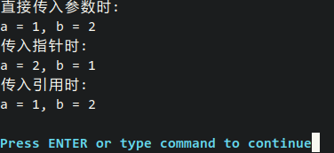

> C++中定义了**引用类型(reference type)**，存在左值引用(lvalue reference)。而在C++11中，新增了**右值引用(rvalue reference)**这一概念， 在此一并讨论。

# 1.左值and右值

首先，我们讨论左值和右值两个概念。
**左值(lvalue)**：一个标识非临时性对象的表达式。通常来说，可以将程序中所有带名字的变量看做左值。简化定义为：**占用了一定内存，且拥有可辨认地址的对象**。
**右值(rvalue)**：相对的，右值标识是临时性对象的表达式，这类对象没有指定的变量名，都是临时计算生成的。
考虑以下代码：

```C++
Copyvector<string> arr(3);
const int x = 2;
int y;
int z = x + y;
string str = "foo";
vector<string> *ptr = &arr;
```

在上述代码中，`arr, str, y, z`等都是左值，`x`也是一个左值，且他不是一个可修改的左值；而类似于`2`, `x+y`这类临时(没有专属变量名)的值则是右值。

# 2.引用

我们可以这样理解引用：一个引用是它所引用对象的同义词，是其另一个变量名。
看这样一段代码：

```C++
#inclulde <stdio.h>
int main()
{
    int x = 5;
    int & y = x;
    printf("引用y = %d\n", y);
    return 0;
}
```

运行结果如下：


**(1)左值引用**
左值引用的声明是通过在某个类型后放置一个符号&来进行的。前文代码中的`int & y = x;`便是一个左值引用。
需要注意的是，在定义左值引用时，=右边的要求是一个可修改的左值。因此下面几种左值引用都是错误的：

```C++
#include <stdio.h>

int main()
{
    const int x = 5;
    int y = 1;
    int z = 1;
    int & tmp1 = x;     // ERROR:x不是一个可修改的左值
    int & tmp2 = 5;     // ERROR:5是一个右值
    int & tmp3 = y + z; // ERROR:y+z是一个右值
    return 0;
}
```

编译运行，报错如下：


**(2)右值引用**
类似于左值引用，右值引用便是对右值的引用，它是通过两个`&&`来声明的。

```C++
Copy#include <stdio.h>

int main()
{
    int && x = 5;
    printf("x = %d\n", x);
    return 0;
}
```

运行结果如下：


> **引用和指针的区别**
> 我们知道，指针是在内存中存放地址的一种变量，cpu能够直接通过而变量名访问唯一对应的内存单元，且每个内存单元的**地址都是唯一**的。
> 而变量名和引用，都可以看做内存的一个标签或是标识符，计算机通过是否符合标识符判断是否为目标内存，而**一个内存可以有多个标识符**

# 3.左值引用的用途

因为目前右值引用用途不大，故此处仅列举较为常见的左值引用用途
**(1)作为复杂名称变量的别名**
我们可以写出类似如下的语句：

```C++
Copyauto & whichList = theList[myHash(x, theList.size())];
```

可以看到，我们用简短的`whichList`代替了其原本复杂的名称，这能够简化我们的代码书写。
**(2)用于rangeFor循环**
设想我们希望通过`rangeFor`循环使一个`vector`对象所有值都增加`1`，下面的`rangeFor`循环是做不到的、

```
Copyfor (auto x : arr)   // x仅相当于每个元素的拷贝
    ++x;
```

但我们可以通过使用引用达到这一目的

```C++
Copyfor (auto & x : arr)
    ++x;
```

**(3)避免复制大的对象**
假定有一个`findMax`函数，它返回一个`vector`中最大的元素。若给定`vector`存储的是某些大的对象时，下述代码中的`x`拷贝返回的最大值到`x`的内存中：

```C++
Copyauto x = finaMax(vector);
```

在大型的项目中这显然会增大程序的开销，这时我们可以通过引用来减小这类开销

```C++
Copyauto & x = findMax(vector);
```

类似的，我们在处理函数返回值的时候也可以使用传引用返回。但是要注意，当返回的是类中私有属性时，传回的引用会导致外界能够对其修改。
**(4)参与函数中的参数传递**
在C和C++的函数中，`addSelf(int x)`这类函数对直接传入的参数进行修改并不会改变原有参数的值。而有时我们希望能够实现类似`swap(int a, int b)`这类能够修改原参数的函数时，我们可以通过传指针或传引用实现。
`swap`函数的实现是一个很好的例子

```C++
#include <stdio.h>

void swap_non(int, int);    // 直接传入参数 
void swap_p(int *, int *);  // 传入指针
void swap_r(int &, int &);  // 传入引用

int main()
{
    int a = 1;
    int b = 2;
    printf("直接传入参数时:\n");
    swap_non(a, b);
    printf("a = %d, b = %d\n", a, b);
    printf("传入指针时:\n");
    swap_p(&a, &b);
    printf("a = %d, b = %d\n", a, b);
    printf("传入引用时:\n");
    swap_r(a, b);
    printf("a = %d, b = %d\n", a, b);
    return 0;
}

void swap_non(int a, int b)
{
    int temp = a;
    a = b;
    b = temp;
}

void swap_p(int * a, int * b)
{
    int temp = *a;
    *a = *b;
    *b = temp;
}

void swap_r(int & a, int & b)
{
    int temp = a;
    a = b;
    b = temp;
}
```

运行结果如下：


可以看到，只有在传入指针和传入引用时变量才真正交换。

> 对**直接传入参数**和**传入指针**仍不理解的可以看这篇[博客](https://www.cnblogs.com/Bylight/p/10451598.html)，在此不再描述。


# 4.右值引用的用途

右值引用帮助我们实现以下两个技术：移动语义和完美转发。

- **移动语义**：将内存的所有权从一个对象转移到另外一个对象，高效的移动用来替换效率低下的复制，对象的移动语义需要实现移动构造函数（move constructor）和移动赋值运算符（move assignment operator）。
- **完美转发**：定义一个函数模板，该函数模板可以接收任意类型参数，然后将参数转发给其它目标函数，且保证目标函数接受的参数其类型与传递给模板函数的类型相同。

## 1）移动语义

​	首先，考虑下面swap()的实现

```c++
template <class T>
void swap(T& a,T& b){
	const T tmp=a;
    a=b;
    b=tmp;
}
```

​	初始化tmp之后，我们拥有了a的值的两个副本。为tmp赋值后，我们就有了b的值的两个副本。为b赋值后，我们有了tmp的值（即a的原值）的两个副本，最后我们销毁了tmp。

​	这听上去做了非常多的工作，实际上确实做了非常多的工作。

​	假如我们用这个swap函数去交换一对3000*3000的double类型矩阵，那么开销就会非常大。如果我们只有拷贝操作，就必须要对大量非标准函数和数据结构做类似的工作，因此便引入了“移动语义“。

​	一个比较生动的例子如下：

> 问题一：如何将大象放入冰箱？
> 答案是众所周知的。首先你需要有一台特殊的冰箱，这台冰箱是为了装下大象而制造的。你打开冰箱门，将大象放入冰箱，然后关上冰箱门。
>
> 问题二：如何将大象从一台冰箱转移到另一台冰箱？
> 普通解答：打开冰箱门，取出大象，关上冰箱门，打开另一台冰箱门，放进大象，关上冰箱门。
> 2B解答：在第二个冰箱中启动量子复制系统，克隆一只完全相同的大象，然后启动高能激光将第一个冰箱内的大象气化消失。
> 等等，这个2B解答听起来很耳熟，这不就是C++中要**移动**一个对象时所做的事情吗？
>
> “移动”，这是一个三岁小孩都明白的概念。将大象（资源）从一台冰箱（对象）**移动**到另一台冰箱，这个行为是如此自然，没有任何人会采用先复制大象，再销毁大象这样匪夷所思的方法。C++通过拷贝构造函数和拷贝赋值操作符为类设计了**拷贝/复制**的概念，但为了实现对资源的**移动**操作，调用者必须使用先复制、再析构的方式。否则，就需要自己实现移动资源的接口。
>
> 作者：Tinro
> 链接：https://www.zhihu.com/question/22111546/answer/30801982
> 来源：知乎
> 著作权归作者所有。商业转载请联系作者获得授权，非商业转载请注明出处。

​	在swap这个例子中，我们想要做的只是把变量的所有权转交（即移交对象的指针直接指向原数据首地址即可），并不需要深拷贝（即向内存去申请额外的内存空间，然后再将指针指向的数据一个一个复制到新申请的空间中），而在老版的C++中，我们只能通过拷贝再析构这样的过程去移动对象。

```c++
template <class T>
class Matrix{
	std::array <int,2> dim;
	T * elem;
	Matrix(const Matrix &);	//拷贝构造函数
    Matrix(Matrix &&);	//移动构造函数
    Matrix & operator =(const Matrix &);//拷贝赋值运算符
    Matrix & operator =(Matrix &&);//移动赋值运算符
    ~Matrix();//析构函数
}
```

​	**通过右值，我们就可以将左值的处理和右值的处理分离。**

​	我们可以为Matrix定义移动构造函数，简单地接受其源对象的表示，并将源对象设置为空（销毁代价低）。

​	再进一步，C++中右值可以被赋值给左值或者绑定到引用。类的右值是一个临时对象，如果没有被绑定到引用，在表达式结束时就会被废弃。**于是我们可以在右值被废弃之前，移走它的资源进行废物利用，从而避免无意义的复制。**被移走资源的右值在废弃时已经成为空壳，析构的开销也会降低。

```c++
template <class T>
Matrix <T>:: Matrix (Matrix &&a)
	:dim{a.dim},elem{a.elem}
{
	a.dim={0,0};
    a.elem=nullptr;
}
```

​	例如，如果我们使用STL中的vector中的移动赋值运算，在移动之后，原vector中的内容会被清空。

```c++
vector <int> a(10);//10 个 0
vector <int> b;
b=move(a);
cout<<a.size()<<endl;//输出：0
```

​	在标准模板库中，只要使用了move函数，对象都会将自身内容清空，保证程序员不能再使用原对象。

```c++
std::unique_ptr<int> u1(new int);
std::unique_ptr<int> u2(std::move(u1));
cout << "u1: " << (u1 ? "not null" : "null") << endl; //输出为 "u1: null"
```

​	使用移动会使得代码更加高效，特别是移动操作通常不会抛出异常，因为不会向内存去申请额外的空间，安全性也因此大大提高。


## 2）完美转发

​	完美转发即保持左值还是左值，右值还是右值。

​	这一需求在C++11中被`std::forward`所实现。

```c++
#include <iostream>

template<typename T>
void print(T & t){
    std::cout << "左值" << std::endl;
}

template<typename T>
void print(T && t){
    std::cout << "右值" << std::endl;
}

template<typename T>
void testForward(T && v){
    print(v);
    print(std::forward<T>(v));
    print(std::move(v));
}

int main(int argc, char * argv[])
{
    testForward(1);

    std::cout << "======================" << std::endl;

    int x = 1;
    testFoward(x);
}

```

​	按照常规的思维，对于`main`里的第一个`testForward(1)`期望输出应当为：

```
右值 //diff
右值
右值
```

​	然而实际的结果为：

```
左值 //diff
右值
左值
```

​	你会发现传入的参数`1`被认为是左值，这就很奇怪了，明明`main`里传的参数是个右值，怎么到这里就变成左值了呢？

​	实际上这是因为在经过函数传参后，1变成了左值（因为在内存中分配了空间）。

​	同时要注意一点，这里的`T && v`被称为`通用引用类型`，**它即可接收左值，也可以接收右值。**并不是指v这个参数是一个右值引用。

​	而`1`由于被分配了空间，所以原本在`main`中的右值却在`testForward`中被认为是左值，这是不能接受的。因而我们就需要“完美转发“去解决这个问题。