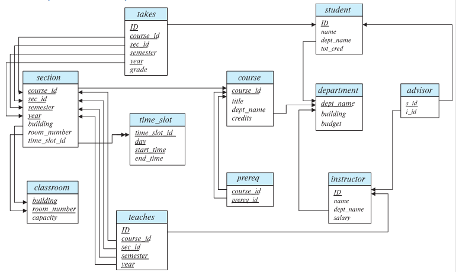

# 数据库系统概念第二章——引言笔记

## 1. 数据库模式与数据库实例

​	数据库模式：数据库的逻辑结构。

​	数据库实例：某时刻数据库中数据的快照。

## 2. 键（keys）

1. 超键（superkey）：能够唯一确定每一个元组
2. 候选键（candidate key）：是一个超键；且最小
3. 主键（primary key）：候选键中被数据库设计者指定的那一个
4. 外键（foreign key）：在另一个关系模式中被指定为主键（称为“参照关系”）

## 3. 模式图

### 3.1 说明

1.主码的属性用下划线标注。

2.每个关系用一个矩形表示。

3.外码依赖用 从参照关系的外码属性到被参照关系的主码属性之间的箭头表示。

​	比如说，对于takes和student关系，ID是student的主码，也是takes的外键。

## 4. 关系代数(Relational Algebra)

### 4.1 六种基本关系代数运算

1. 选择运算

   返回输入关系中，满足条件（谓词）的行。

2. 投影运算

   对输入关系所有行输出指定属性，并去除重复元组。

3. 笛卡儿积

4. 并

5. 差

6. 重命名（Rename）

### 4.2 扩展运算

1. 自然连接

2. 交

3. 除

4. 赋值运算

5. 外连接（左外/右外/全外）

   左外连接（left outer join）：类似于自然连接，但是对于运算符左侧关键词不匹配的元组用null填充所有来自右侧关系的属性，再将产生的元组加到自然连接的结果中

   左外连接=自然连接+运算符左侧关键词不匹配的元组

   同理，右外连接=自然连接+运算符右侧关键词不匹配的元组

   同理，全外连接=自然连接+运算符右侧关键词不匹配的元组+运算符左侧关键词不匹配的元组

6. 广义投影

   在投影的基础上，允许对结果属性进行+，-，*，/的运算，例如：
   $$
   Π_{ID,name,salary/12}(instructor)
   $$
   
7. 聚集

   聚集运算可以用下列式子来表达：
   $$
   _{G_1,G_2,...G_n} G _{F_1(A_1),F_2(A_2),...,F_m(A_m)}(E)
   $$
   其中G~n~ 是属性名，表示要聚集的属性，F~n~(A~m~)表示聚集函数，比如$avg$，$sum$等

   例如：
   $$
   _{deptname}G_{average(salary)}(instructor)
   $$
   就表示：先对表$instructor$中的$deptname$做聚集，然后再对每一个分组的$salary$属性求平均。
